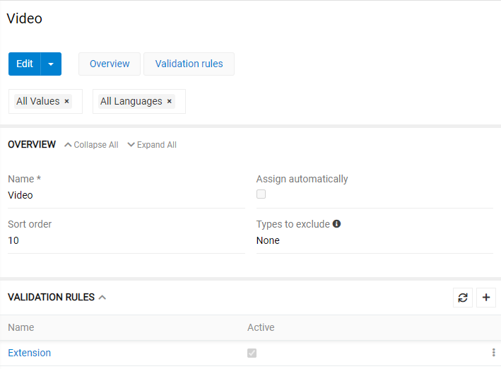
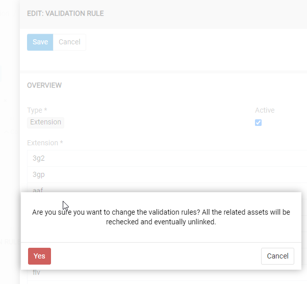

# Asset Types

An administrator can manage asset types in Administration/Asset Types menu. 

The "Name" menu states for the name of an asset type, "sort order" defines the sort order in witch these will be shown. 

## Types to exclude ##
Here you can define asset types, which will unassigned from the asset, if current asset type is assigned. 

## Assign automatically ##
If "Assign automatically" checkbox is checked, the system will check automatically, if a newly uploaded asset can receive this asset type automatically, provided the validation rules for this asset are complied with. 

When a validation rule is changed, all assets are automatically re-validated according to the updated validation rules.

