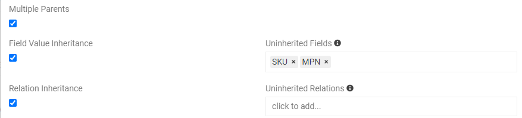
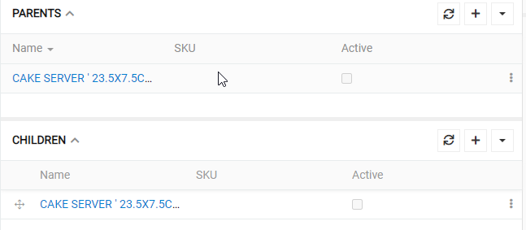

# Inheritance

For every entity in your AtroPIM you can choose to have relation between entities. This will include children-parent relationship. To add new or edit existing go to Administration/Entities. For this example we will use "Products" (see picture below). You may want to create imaginable products first, and then create product variants, that are real store products. For example, we may have dozens of blue shirts with different materials and sizes, but otherwise they are different variants of the same product. To do and organize it easily you would like product inheritance. Thus way imaginable blue shirt will be parent product and real products will be its children.

Checkboxes above add inheritance rules to products. It means what fields will be inherited (copied) from parent product to children. 

## Inheritance settings

You can set inheritance rules by the settings below. To set them go to Administration/Entities.

- `Field Value Inheritance` checkbox allows children to inherit field values from parents (like description). When checked you will see `Uninherited Fields` - this sets what fields will not be inherited. In our example SKU and MPN fields are unique product codes, so they cannot be inherited.

- `Relation Inheritance` checkbox allows children to inherit relations from parents (like catalog). When checked you will see `Uninherited Relations` - this sets what relations will not be inherited. As you can see in the picture below it is not a required field - you can inherit all relations.

- `Multiple Parents` checkbox allows children to have multiple parents. Normally only one is allowed. NOTE! When you have more than one parent, system will not understand from what parent to inherit, so no inheritance will be made.

## Inheritance in an entity

On your entity page you will see parents and children (see picture below). In this example you can see that a product has already a parent and a child. This is made to structure data even better.

