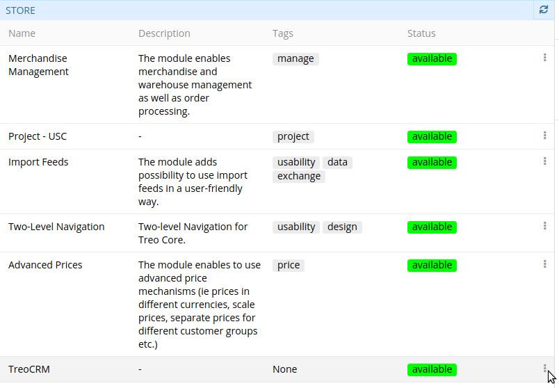

# Module Installation

Prior to installation, make sure that the module has the **available** status. 

To install a module:

1. Go to Administration > Update & Modules.

2. Open the drop-down menu of the module to be installed:

   

3. Click the "Install" button.

   
   
   Having clicked "Install", AtroCore generates a schema with chosen module(s) and their dependencies for further installation.

4. To start the module(s) installation process, click on the button "Update" and confirm the action: 
   
   

   During the update, you will see realtime logs to get actual information about the process.

## Module Update

To update modules click an the button "Update". All the modules will be automatically updated.

## Module Deletion

To delete a module from the system:

1. Go to Administration > Update & Modules.
2. Open the drop-down menu of the desired module from the "Installed" panel.
3. Click the "Delete" button.
4. Click on the button "Update".

## Module Purchase

You can see the whole list of AtroCore modules on our website: [English version](https://atropim.com/store), [German version](https://atropim.com/de/shop).

Following status options are available for each module:

* **available** – module is available for installation
* **buyable** – module should be purchased, to be able to install it

The status is changed automatically from **buyable** to **available** after the modue activation.
After you have purchased a module contact our support and provide your system IDs, which can be found on the "Administration > Settings" page. We need this ID to activate the module for your software instance. You can provide the IDs for your production, stage and testing environments.

In case of successful activation, the needed module will be switched to "available" within a few several minutes.
    

