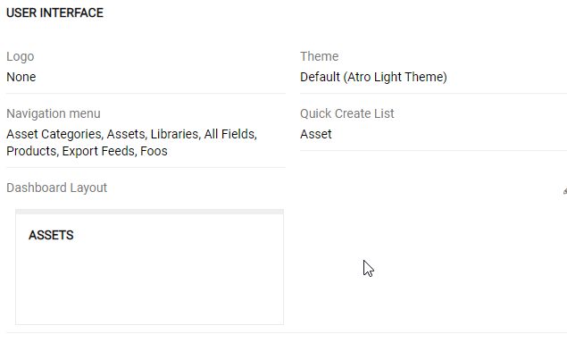

# Portals

## What is Portal?

Portals are intended to give external users limited access to your system. These externals could be your suppliers, partners, customers, photographers, copywriters, translators, etc. A Portal may have own users, called Portal Users. Different Portal Roles may be assigned to Portal Users.

## Creating a Portal

To create a portal, go to `Administration / Portals` and press `Create Portal` button. 

On `General` panel you need to assign the Portal's name, role, set it active/inactive and assign an URL for the portal users to access it. Portal URL can use a subdomain, if this case this domain should be properly configured, or a subfolder, in this case you just need to define the subfolder directly here, no additional configuration is needed. 

On the `Settings` panel you can set the `Default currency` and the default `Locale` for the portal users.

In `user interface` panel you select which entities should be accessible via navigation menu in the portal, select the logo, default theme and available entities for the Quick Create. First, you can select logo and theme.

In the pictures above you can see an example of such portal. Using this particular one a photographer, for example, can upload product photos as assets personally. No other functions are available so no harm to you product information will be done. 

Portals can be also edited, duplicated or deleted.

## Portal Roles

Portal Roles enables to define permissions and access rights for Portal Users. To set them go to `Administration / Portal Roles` and create a new role by clicking on the `Create Portal Role` button or edit existing one by clicking it and then pressing `Edit` button (see picture below). 

Here you can see all the entities in the system and access rights of this role to them. Rights are entity-based (so you select them for each entity separately). 

### Access
To enable configuration of the permissions for an antity you need to set access option for this entity to "enabled". To disable access set this option to "disabled". "Not-set" means this entity uses the global configuration for "ALC Strict Mode" in the `Administration / Setting`. If it is activated "not-set" means that per default access is disabled, if not – than access is enabled.

### Permissions

- `Create` – permission to create new data records in the entity. Simply select yes or no.
- `Read` – permission to read data records in this entity. Select all to ebable access to all data records.
- `Edit` – permission to edit data records in this entity. Select all to ebable access to all data records.
- `Delete` – permission to delete data records in this entity. Select all to ebable access to all data records.
- `Stream` – permission to see the "Stream" panel, to be able to post comments, read comments, and the the changed within the data record – who have done the change, what was the old value and when it was done. 

### Access levels 

For Read, Edit and Delete permission you can select the access level by setting it to all, account own or no:
- `All` – all data records can be accessible 
- `Account` – only data records linked with the account can be accessible
- `Own` – only the own data records can be accessible (where the Portal User is Assigned User or the Owner of the data record
- `No` – no data records can be accessible.

The example for our case is on the picture below:

To set some Portal Roles as Default Roles in the Portal select these directly for the portal. In this case these Portal Roles will be automatically assigned to all Portal Users.

> Please note, any configured Portal Role can be used in multiple portals.
