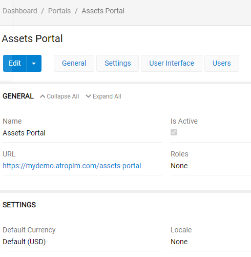
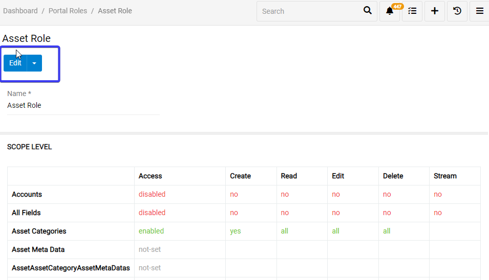
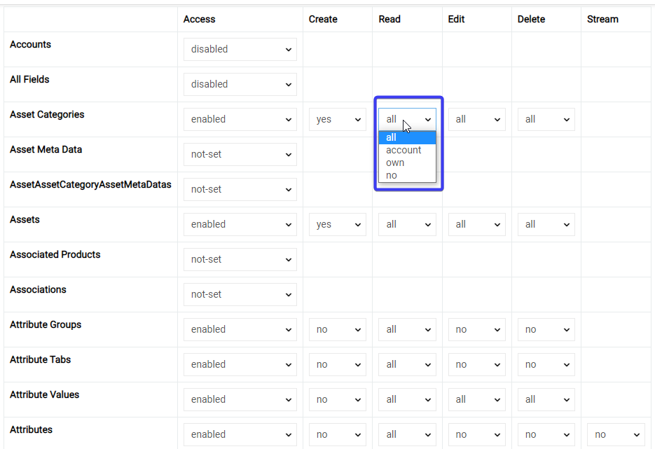
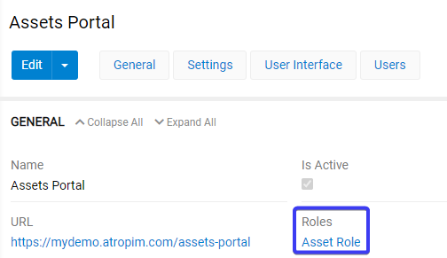

# Portals

## Portal goal

For users you do not want to give full access rights, you can provide them with `Portals`. To see them go to `Dashboard/Portals`. For this example we will use "Assets Portal". It will be used to give access rights to, for example, photographers to upload pictures of your products.

## How to create a portal

To create a portal go to `Administration/Portals` and press `Create Portal` button. You will see a portal creation menu. Here in `General` tab you can select Portal's name, role, set it active and create url you will need for user (see picture below).

In `Settings` tab you can select `Default currency` and `Locale` - currency and language of the of the user ui.

In `user interface` tab you san set what entities new user can see. First, you can select logo and theme.

`Navigation menu` is all submenus user will be able to see (they will be available on his screen on the right). `Quick create list` is list of things user can create.

In the pictures above you can see an example of such portal. Using this particular one a photographer, for example, can upload product photos as assets personally. No other functions are available so no harm to you product information will be done. 

## Portal Roles

Portal roles set rules and restrictions for portal users. To set them go to `Dashboard/Portal Roles` and create a new role by pressing `Create Portal Role` or edit existing one by clicking it and then pressing `Edit` button (see picture below). In this example we will continue editing a photographer's portal.

Here you can see entities and access rights of this role to them. Rights are entity-based (so you select them for each entity separately). They are:

- `Access` - rights to do anything in this entity. Without `Access` set to `enabled` there will be no rights you can see below (you can not do anything with the entity withot having access to it). You can set  `enabled`, `disabled` or `non-set`. `Non-set` sets default permissions according to `ACL Strict Mode` checkbox in `Administration/Settings` menu.
- `Create` - rights to create data in this entity. Simply select yes or no.
- `Read` - rights to read data in this entity. You can set all data in the entity to be readable, no data, only own data or account data (see square on the picture below). Account is all the data owned by n account that gave the rights.
- `Edit` - rights to edit data in this entity. You can set all data in the entity to be editable, no data, only own data or account data. 
- `Delete` - rights to delete data in this entity. You can set all data in the entity to be deletable, no data, only own data or account data. 
- `Stream` - access to the panel that shows changes in the data and who changed.

The example for our case is on the picture below:

Now when role is set we can select it for our portal.

> Please note, that one role can be selected for many portals (if they have same rights). If you have a role already set you can select it right away.