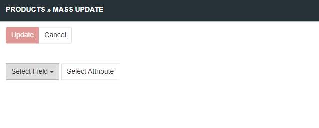
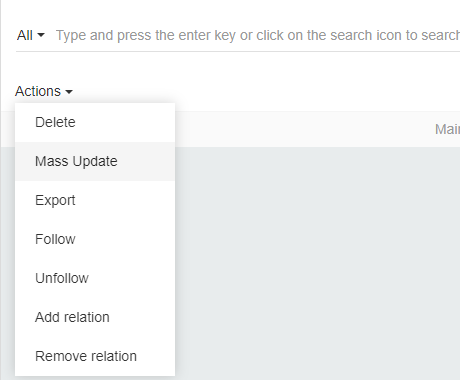
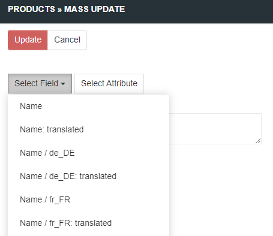
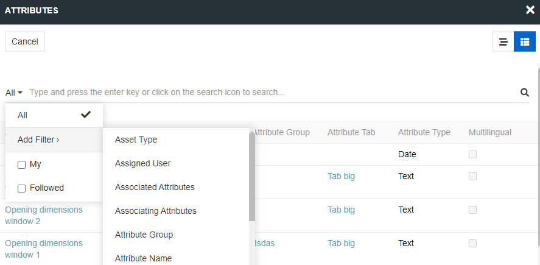
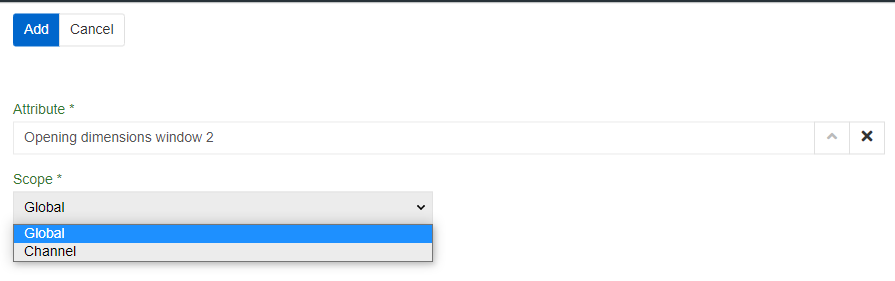
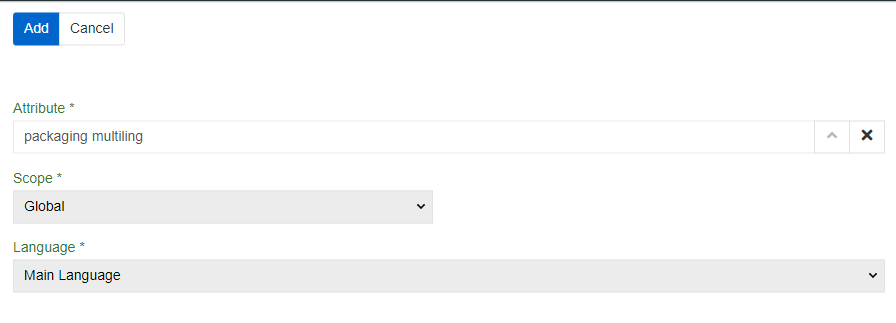

# Mass updates

Mass updates is a tool used to quickly modify information that is the same for different records. You can mass update all the fields for products or categories and/or attributes for products.

You can select any number of fields and/or attributes to update.

To select mass update first select records you want to update. Use searching and filtering to find what you need and check all results you need. Alternatively you can check a checkbox in a header row - it will select all records that are currently filtered (including ones on next pages if there are such). Then select `Actions/Mass Update` to proceed to Mass update popup.

When all fields and/or attributes you wanted are selected and their values are set press `Update` to start updating process. If everything is ok you will see `Success` message.

## Mass update to fields

To update field select `Select Field` in Mass update popup. Then select a field you need from a list. Then apply field value as usual. If the field you selected is already selected it is not shown to you in the list.

> Note that in Mass update you can update fields to an empty value even if they are required in one or more records. To do so just select a field and apply no field value. So check if you actually applied field values for not clearing all the data.

> Unique to each record fields (such as Id) can not be selected to be mass updated.

## Mass update to attributes

To update attribute select `Select Attribute` in Mass update popup. Then select an Attribute you need from a new popup. Here you can select different view variants and apply filters same as in `Attribute` entity. Still you cannot select more than one attribute at a time. To select more than one press `Select Attribute` and select new attribute. If the attribute you selected is already selected it will add nothing to Mass update popup.

If any/all of your products selected to be mass updated have no attribute the attribute will be linked to the product.

Attributes have scopes so you have to select one proceed (same as adding attribute to a product). If any/all of your products selected to be mass updated have no attribute with selected scope the attribute will be linked to the product with selected scope. If the product cannot have such scope nothing will be updated/created.

> Note that attributes with different scope are treated as different attribute values.

If an attribute is multilingual you have to also select a language. If an attribute has a scope where the language you selected is not supported the value will not be created.

> Note that attributes with different language are treated as different attribute values (except attribute with List or Multi-value list types - they are same value for all languages).