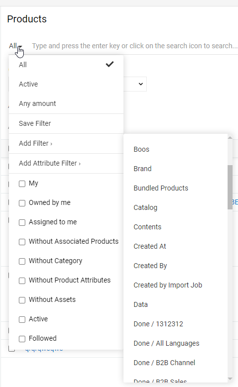
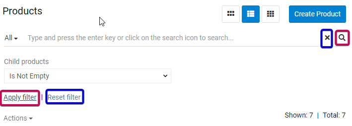
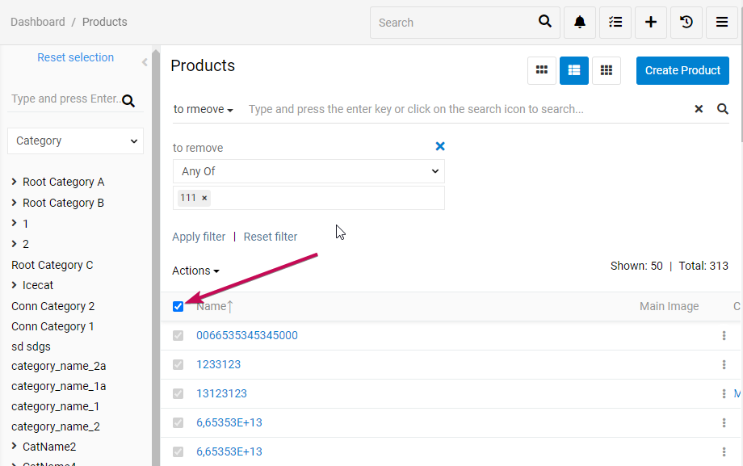
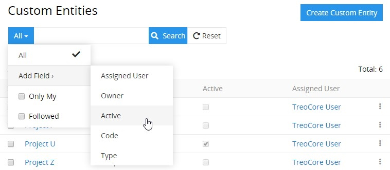
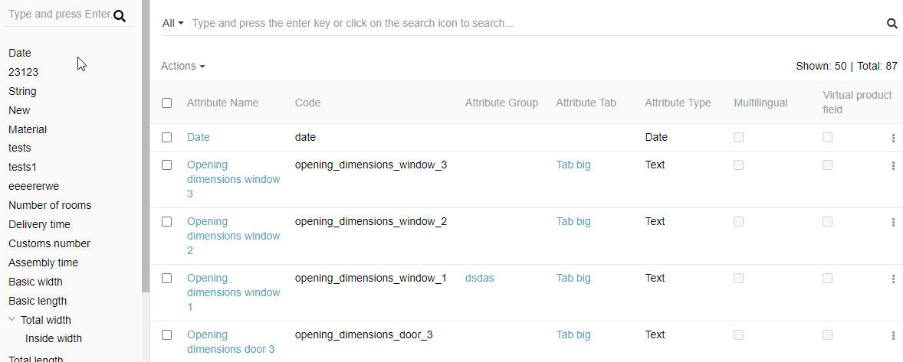

# Search and Filtering

Use the [global search](./user-interface.md#global-search) if you wish to search globally across all the entities in the system. The entities and fields available for searching can be configured by the Adminitrator.

Searching works on the current entity records, while filtering works also on the related records, which are configured by the administrator.

## Search

Search and filtering allow you to quickly focus on the records you want to see. These sections are automatically available on each entity [list](./views-and-panels-core.md#list-view) view page:

*Search and filtering on the products list view page*

To perform a search operation, enter your search query into the corresponding field and hit the `Enter` key on your keyboard or click the `Apply filter` button (red squares). To reset all filters click the `Reset filter` button. You can have more than one filter at once - by clicking `Reset filter` button or cross on the right (blue squares) all of them will be reset. If you want to close one particular filer use cross in the top right of the filter you want to close.

Wildcards can be used for search, at any place in the search string, separately or in any combination.

| **Character**    | **Use**                                           |
| :--------------- | :------------------------------------------------ |
| % or *           | Matches any number of characters, including zero  |
| _                | Matches only one character                        |

> Please consider, only the fields configured by the Administrator at "Text Filter Fields" for the current entity will be searched through.

### Full-text Search

> Fulltext search can be used if configured by the Administrator for the current entity.

In Global Search full-text search is always applied for entities with enabled full-text search.

If activated for the entity the full-text search is also applied when you search in the list view. Though it can be skipped for some search queries. Yet, it's possible to force a full-text usage by using prefix "ft:" in your search query, eg "ft: john".

For InnoDB tables the following operators are available:

| **Character**    | **Use**                                           |
| :--------------- | :------------------------------------------------ |
| +                | A leading plus sign indicates that this word must be present.        |
| -                | A leading minus sign indicates that this word must not be present.   |
| *                | Wildcard operator can be appended to the word to be affected.        |
| "                | A phrase included in double quotes must be contained exactly as it was typed.|
| (no operator)    | The word is optional, but the rows that contain it are rated higher. |
 
> Please note, that MySQL option ft_min_word_len defines min word length available for full-text search. By default it's 4. If you change this paramater, you need also to set the `fullTextSearchMinLength` parameter at data/config.php: `'fullTextSearchMinLength' => 3`. MySQL has a blacklist of words that are not available for full-text search. 

## Filtering

To filter your entity records, open the filter drop-down list and set the desired checkbox(es):

To clear all filters, click the `Reset` button, located to the right of the search field.

You can have one or more filters based on a certain field for all field types. The exception is field types that can be used as a filter only once (because there is no need for it), which are:
  - Boolean;
  - Array;
  - Multi-enum;
  - Enum;
  - Related entities.

### Logical Operators

The system behavior is different for the OR and AND logical operators:

- Operator AND is automatically applied between filters set up for different fields, e.g. `name` and `brand`.
- Operator OR is automatically applied between filters set up for the same field, e.g. both filters set up for `name`.

Logical operator NOR is directly not available, but can be set by defining specific filter criteria for almost each field type.

### Available Filtering Criteria

Depending of the field type, you can apply the following filtering criteria:

| **Field Type**                              | **Filtering Criteria** | **Input Value**                                            |
| :------------------------------------------ | :--------------------- | :--------------------------------------------------------- |
| *Array, Multi-Enum*                        | –                      | Value list, multiselect                                    |
| *Address*                                   | –                      | Input field                                                |
| *Boolean*                                   | –                      | Checkbox                                                   |
| *Auto-increment, Currency,  Integer, Float* | Is Not Empty           | –                                                          |
|                                             | Is Empty               | –                                                          |
|                                             | Equals                 | Input field                                                |
|                                             | Not Equals             | Input field                                                |
|                                             | Greater Than           | Input field                                                |
|                                             | Less Than              | Input field                                                |
|                                             | Greater Than or Equals | Input field                                                |
|                                             | Less Than or Equals    | Input field                                                |
|                                             | Between                | 2 Input fields                                             |
| *Date, DateTime*                            | Last 7 Days            | –                                                          |
|                                             | Ever                   | –                                                          |
|                                             | Is Empty               | –                                                          |
|                                             | Current Month          | –                                                          |
|                                             | Last Month             | –                                                          |
|                                             | Next Month             | –                                                          |
|                                             | Current Quarter        | –                                                          |
|                                             | Last Quarter           | –                                                          |
|                                             | Current Year           | –                                                          |
|                                             | Last Year              | –                                                          |
|                                             | Today                  | –                                                          |
|                                             | Past                   | –                                                          |
|                                             | Future                 | –                                                          |
|                                             | Last X Days            | Input field                                                |
|                                             | Next X Days            | Input field                                                |
|                                             | Older Than X Days      | Input field                                                |
|                                             | After X Days           | Input field                                                |
|                                             | On                     | Date picker                                                |
|                                             | After                  | Date picker                                                |
|                                             | Before                 | Date picker                                                |
|                                             | Between                | 2 Input fields                                             |
| *Enum*                                      | Any Of                 | Value list, multiselect                                    |
|                                             | None Of                | Value list, multiselect                                    |
|                                             | Is Empty               | –                                                          |
|                                             | Is Not Empty           | –                                                          |
| *Varchar, Text,  URL, Wysiwyg*      | Starts With            | Input field                                                |
|                                             | Contains               | Input field                                                |
|                                             | Equals                 | Input field                                                |
|                                             | End With               | Input field                                                |
|                                             | Is Like (%)            | Input field                                                |
|                                             | Not Contains           | Input field                                                |
|                                             | Not Equals             | Input field                                                |
|                                             | Is Not Like (%)        | Input field                                                |
|                                             | Is Empty               | –                                                          |
|                                             | Is Not Empty           | –                                                          |
| *Related Entity  (as n:1 relation)*         | Is                     | Related entity record, select                              |
|                                             | Is Empty               | –                                                          |
|                                             | Is Not Empty           | –                                                          |
|                                             | Is Not                 | Related entity record, select                              |
|                                             | Any Of                 | Related entity records, multiselect                        |
|                                             | Is Empty               | –                                                          |
|                                             | Is Not Empty           | –                                                          |
|                                             | None Of                | Related entity records, multiselect                        |
| *Related Entity  (as n:m relation)*         | Is                     | Related entity record, select                              |
|                                             | Any Of                 | Related entity records, multiselect                        |
|                                             | Is Empty               |                                                            |
|                                             | Is Not Empty           |                                                            |
|                                             | None Of                | Related entity records, multiselect                        |
| *Image, File, Attachment Multiple*          | –                      | Filtering for these field types is not possible  (for now) |

### Subfilters

When adding filters to your search you can add additional subfilters. To add subfilter you have to filter data in the popup menu (see picture below) and then check the checkbox in the header.

The search will be shown as on the picture below:

 

This way is more accurate then selecting all appropriate results to subfilter because:
- it is faster, especially when you have a lot of results
- whenever database is updated you do not have to manually update the filter - it is automatically updated according to new information

> When you select all results, you can not unselect individual results. To do so you have to manually select them. 

> When using `select all results` option, all additional data that fit the filters will be automatically added if you reuse this filtering.

### Predefined Search Filters

Predefined search filters are available in the drop-down menu on the left of the search field on any entity list view page:

To filter the records, select the desired checkbox or several checkboxes. 

To extend the list, please contact your developer.

### Using Custom Search Filters

To save a custom search filter, select the `Add filter > 'desired filter'` option from the filtering drop-down list:

The selected filter will be added to the current page:

If needed, click the `X` button to remove the added filter.

> To extend the list of fields to be used for filtering, please, contact your administrator.

### Saving Custom Search Filters

You can create custom search filter templates. To do this, add the desired filters as described above and select the `Save filter` option from the filtering drop-down list:

On the "Save filters" page that appears, enter the name for the filter(s) and click the `Save` button to create the template. As a result, your search filter template will be added to the filtering drop-down list and set as a currently applied filter: 

To remove your custom search filter template, use the `Remove filter` option from the filtering drop-down list:

To complete the action, confirm your decision in the confirmation box that appears on top of the page.

## Automatic Search Mask Recognition *(in development)*

AtroPIM has automatic search mask recognition. This can be considered as a quick search function, i.e. when you start typing, AtroPIM automatically determines the search mask type of your search string. Automatic search mask recognition is available for the following fields: Text, Number, Date, and Time.

Depending on the search mask type, the system searches through all entity fields of the appropriate field type. A pop-up with auto-suggestions appears with the information about field name and amount of search results for this field, i.e. "Address: 3 results", and the text link(s) to show the results.

If nothing is chosen from the auto-suggesting pop-up, click the magnifier icon to perform normal search (only through the fields listed in the metadata for this entity).

After clicking on the search results, the appropriate filter will be set automatically and the search field will be left empty.

|   **Search Mask Type**  |        **Field Types to Be Searched**        | **Applied Filter Criteria** |
|:-----------------------|:--------------------------------------------|:---------------------------|
| Теxt, e.g. "atro 123"   | Address, Number, Varchar, Text, URL, Wysiwyg | Starts with                 |
| %Text, e.g. "%atro 123" | Address, Number, Varchar, Text, URL, Wysiwyg | Consists                    |
| Numbers, e.g. "123"     | Address, Number, Varchar, Text, URL, Wysiwyg | Starts with                 |
| Numbers, e.g. "123"     | Auto-increment, Currency, Integer, Float     | Is                          |
| Date, e.g. "12.12.2018" | Date, DateTime                               | On                          |

## Hierarchy Panel

For entities with `Hierarchy` type there is additional panel where you can search and filter records. You can select a category to show by (if there is any).

You can see the entity by its hierarchy, as a tree. Press arrows to proceed down by hierarchy and `Show more` to get more records to see. Selecting a record here is opens details menu. In the details menu hierarchy panel shows the way to the record. If you are showing by, for example, category - it will show you the category the product is in. If there is no such it will show you the general tree.

You can select inheritance in the hierarchy panel. To do so, go to `Administration/Entities` then `Edit` and check the the `Drag & Drop` checkbox.

If you are searching then the hierarchy panel adjusts to the filters implied. If there is a filter in a Hierarchy Panel then it will not be overwritten.

