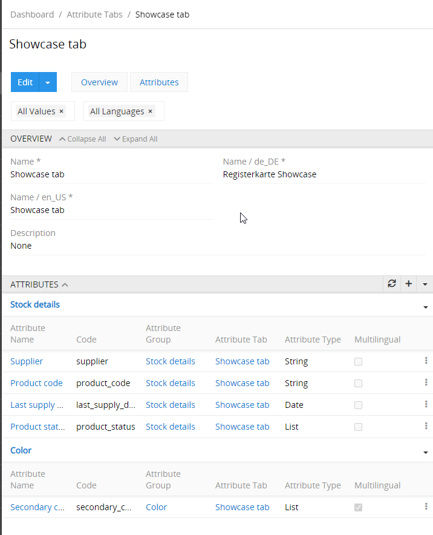
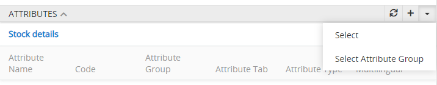
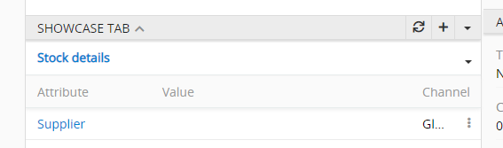
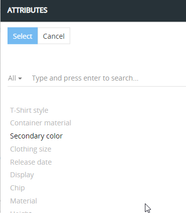

# Attribute Tabs

Attribute Tabs can be used as additional layer to structure your Attribute Values. Attribute Tabs are additional panels for your attributes on the product detail page. Within each Attribute Tab attributes are grouped by Attribute Groups. Both Attribute Groups and Attribute Tabs are optional and are assigned on the level of a single attribute.

You can use: 
- the default panel for the attribute values – attribute values are displayed here for the attributes which are not assigned to any Attribute Tab
- custom multiple Attribute Tabs – if you define them and assign certain attributes to them
- or both.

Attribute Tabs are also used to display the attribute values in our Web Catalog Application.

## Creating a new Attribute Tab

To create a new Attribute Tab press `Create attribute tab` button. There you set the name (in different languages) and the description. After saving it (or when opening existing tab) you will see the panel with the assigned attributes, grouped by Attribute Group.

## Adding new attributes to an Attribute Tan

To add new attributes, press `+` button or open a drop-down menu `▼` and then click on "Select" to select multiple attributes at once or click on "Select Attribute Group" to assign all the attributes of the respective selected Attribute Group (attributes which are assigned to this Attribute Group).

## Attribute Tab on Product Detail page

If configured by the Admin via section `Administration / Layouts / Products / Relation panels` Attribute Tabs will be shown on the Product Detail Page. These Panels will show values for the attributes which are assigned to the respective Attribute Tab.

Via each Attribute Tab you can add only attributes to a product, which a assigned to this Tab. So make sure to use the proper Tab while assigned attributes to the products.

