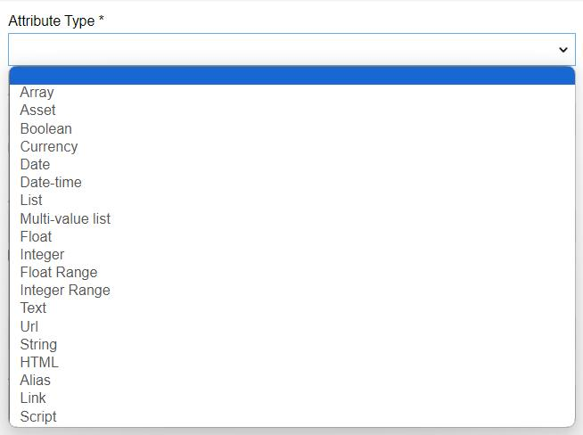

# Attributes

**Attributes** – characteristics of a certain [product](./products.md) that distinguish it from other products, e.g. size, color, functionality, components and features that affect the product's attractiveness or acceptance in the market. 

An attribute can be assigned to only one [attribute group](./attribute-groups.md). Value of a certain attribute set for a certain product is called *product attribute value*. It is possible to define the same product attribute different values for each channel. 

Attributes can be assigned to several [product families](./product-families.md), so if the product for that product family is created, the selected attribute will be added to the product attributes automatically.

Attributes can be activated or deactivated. Deactivated attributes cannot be used in the system, e.g. no values can be set to them or transferred via any channel. All the values of the deactivated attributes are hidden and will be shown again after the attribute is activated again.

## Attribute Fields

The attribute entity comes with the following preconfigured fields; mandatory are marked with *:

| **Field Name**           | **Description**                   |
|--------------------------|-----------------------------------|
| Type					   | Attribute types are predefined in the system and can be defined via the drop-down menu                |
| Code *                   | Unique attribute code, consisting of small letters (a..z), numbers (0..9) and underscore symbol ("\_")        |
| Name *      | Attribute name, can be set in different languages                    |
| Attribute Group          | Attribute group name               |
| Attribute Tab            | Attribute tab name                 |
| Default value            | you can define a default value for an attribute of type "Unit". If the default value is set it will be applied automatically, as soon as an attribute is assigned to a product.|
| Scope                    | The default scope can be set to "Global", or to "Channel", if the attribute should have a channel-specific value, in this case you also need to choose a Channel. Default Scope and Channel are applied to an attribute when the attribute is assigned to an Attribute Group or a Product directly.|
| Required                 | When checked the attribute will be marked as required for an Attribute Group or for a Product, as soon as it is assigned.|

> If multiple attributes are assigned to an Attribute Group or to a Product at once the default Scope, Channel and Required option are always applied.

If you want to make changes to the attribute entity (e.g. add new fields, or modify attribute views), please contact your administrator.

## Available Attribute Types

Attributes are automatically validated according to their type. The following attribute types are available in the AtroPIM system:

| **Attribute Type**           | **Description**                   |
|------------------------------|-----------------------------------|
| Array                        | Data array, where each product attribute can get more than one value. No array values can be set upon the attribute creation or editing.|
| Boolean                      | Checkbox for the product attribute				|
| Date                         | Date picker with the calender and option to set up the date manually |
| DateTime                     | Date and time picker						|
| List                         | List of possible values, which is set up upon the attribute creation or editing; a single value can be set for the product attribute. |
| Float                        | Number with a decimal part		|
| Integer                      | Integer attribute					|
| Float Range                  | Range of values from smallest to largest of type float	|
| Integer Range                | Range of values from smallest to largest of type integer	|
| Multi-value List             | List of possible values, which is set up upon attribute creation or editing; multiple values can be set for the product attribute. |
| Text                         | Text area, for long multiline texts		|
| Url                          | URL with a hyperlink, which is automatically created |
| String                    | Short text attribute				|
| HTML                      | Text area for long multiline texts that contains a built-in text editor   |
| Asset			           | File attachment  |
| Alias			           | displays the value of another attribute(s) linked to it |
| Link			           | Reference to any other entity |
| Script                      | a dynamic attribute that can have different data types and display the value of any field or attribute configured in the field of type Twig  |

## Creating

To create a new attribute record, click `Attributes` in the navigation menu to get to the attribute [list view](#listing) and then click the `Create Attribute` button. The common creation pop-up window will appear:

Here enter the attribute name and code and select its type from the `Attribute Type` drop-down list. Define its attribute group using the corresponding select button, if needed. Your username is loaded to the `Owner` and `Assigned user` fields by default. You can change them via the corresponding select buttons, as well as define the team, if needed. Click the `Save` button to finish the attribute record creation or `Cancel` to abort the process.

If the attribute code is not unique, the error message will appear notifying you about it.

Please, note that attribute type cannot be changed after the attribute is created. 

When creating attribute records of the `Enum`, `Multi-Enum`, `Enum Multilang`, and `Multi-Enum Multilang` types, their attribute values should also be defined:

Alternatively, use the [quick create](./user-interface.md#quick-create) button on any AtroPIM page and fill in the required fields in the attribute creation pop-up that appears:

## Listing

To open the list of attribute records available in the system, click the `Attributes` option in the navigation menu:

By default, the following fields are displayed on the list view page for attribute records:
- Attribute name
- Code
- Attribute group
- Attribute type

To sort attribute records order in the list, click any sortable column title; this will sort the column either ascending or descending. 

Attribute records can be searched and filtered according to your needs.  For details on the search and filtering options, refer to the [**Search and Filtering**](./search-and-filtering.md) article in this user guide.

To view some attribute record details, click the name field value of the corresponding record in the list of attributes; the [detail view](./views-and-panels.md#detail-view) page will open showing the attribute records. Alternatively, use the `View` option from the single record actions menu to open the [quick detail](./views-and-panels.md#quick-detail-view-small-detail-view) pop-up.

### Mass Actions

The following mass actions are available for attribute records:
- Remove
- Mass update
- Export
- Add relation
- Remove relation

For details on these actions, please, see the [**Mass Actions**](./views-and-panels.md#mass-actions) section of the **Views and Panels** article in this user guide.

### Single Record Actions

The following single record actions are available for attribute records:
- View
- Edit
- Remove
 

 
For details on these actions, please, refer to the [**Single Record Actions**](./views-and-panels.md#single-record-actions) section of the **Views and Panels** article in this user guide.

## Editing

To edit the attribute, click the `Edit` button on the [detail view](./views-and-panels.md#detail-view) page of the currently open attribute record; the following editing window will open:

Here edit the desired fields and click the `Save` button to apply your changes.

Besides, you can make changes in the attribute record via [in-line editing](./views-and-panels.md#in-line-editing) on its detail view page.

Alternatively, make changes to the desired attribute record in the [quick edit](./views-and-panels.md#quick-edit-view) pop-up that appears when you select the `Edit` option from the single record actions menu on the attributes list view page:

### Associated Attributes

The System has the functionality of automatic attribute linking to a Product Family or Product data record. If some attribute is assigned other related attributes will be assigned as well. This is realized with the help of hierarchies. Attributes is a hierarchical entity. After a new record is created you can assign Associated Attributes and Associating Attributes to it.

- **Associating Attributes** – are "parent" attributes, assigning of which will cause automatic assiging of the current attribute. 
- **Associated Attributes** – are "child" attributes, which will be automatically assigned if the current attribute is assigned.

In the Tree Panel you can see the full attribute hierarchy and change it by using drag-and-drop.

## Removing

To remove the attribute record, use the `Remove` option from the actions menu on its detail view page

or from the single record actions menu on the attributes list view page:

By default, it is not possible to remove the attribute if there is any product or product family linked with this attribute. The following confirmation pop-up appears:

Select the checkbox to unlink the attribute record from other entities and click `Remove` to complete the operation. Click `Cancel` to abort the process. 

## Duplicating

Use the `Duplicate` option from the actions drop-down menu to go to the attribute creation page and get all the values of the last chosen attribute record copied in the empty fields of the new attribute record to be created. Modifying the attribute code is required, as this value has to be unique.

## Numeric attribute types

There are two types of attributes for displaying numeric data in PIM: Integer and Float. And also the ranges of these two types.
For both attribute types, you can specify a minimum and maximum allowable value (1). 

If you specify these fields for the attribute, the value of the attribute when entered will be validated according to them. If the entered value is not within the valid range, the error message "Value shouldn't be greater (less) then ..." will appear on the screen.

For float or float range attributes, you can also specify the number of decimal places allowed (2). If you leave of this field empty, the number of decimal places is limited to 12 digits by default.

Units of measurement can also be added to attributes of numeric type. The "Measure" field is used for this. A measure is a separate entity that is related to attributes by a many-to-one relationship. You can add an unlimited number of units to each measure and also choose the unit that will be used by default.

To create a new measure record, click `Measures` in the navigation menu (if it is not there, you can add it through Administration --> User interface) and then click the `Create Measure` button. A page for creating a new measure will open

Enter the measure name and code (by default, this field is optional) and click the Save button. To add a new unit to the measure, click the "Create" (+) button on the Units tab. Unit creation pop-up window will appear:

You can create a unit from the measure entity, or vice versa: go to the Unit entity, create a new unit via the "Create Unit" button and choose the measure to which you want to add it. In the "Convert to" field, you can choose the units of measurement to which the current unit should be converted. A default unit can be selected for both the measure and the attribute to which the measure is added.

## Attribute of type link

The link type attribute allows you to add any field of another entity to the product as a link. By clicking on the value of this attribute, you can go to the entity whose field it refers to. When creating an attribute of type link, you need to select the entity to which it refers and its field, which should be displayed as the attribute value.

## Attribute of script type

For some attributes you may need a value that consists of modified (or not) pre-existing values. For this attribute of script type may be needed. 
Scrips are based on twig code (for more detailed information regarding twig syntaxes please go to https://twig.symfony.com/). 

First, you need to select a desired output for the script:
 

Then, by using Twig write a script:
 

To see what the script does you can look at "Script value" field. It selects a random product attribute value from products that the script is assigned to.
 

### Here are some examples of what you can achieve by using attributes of script type:

#### Selecting values for specific product
 

This script finds if the product name is 'Topshop casual shirt' () and selects fields name {{product.name}}, createdAt {{product.createdAt}} and the name of an assigned catalog {{product.catalog.name}}. Then it finds all assets assigned to the product  and selects the name of a product in this asset {{ productAsset.product }} and an asset in this asset {{ productAsset.asset }}.

#### Referencing other attribute value

Here are two options how you can refer to another attribute value. The both find an attribute by Id. Option one is restricted to only current product (though you can select language and scope. If not selected they are 'main language' and 'Global'). The second finds any entity by all its defining fields (for ProductAttributeValue they are productId, attributeId, language and channel).

#### Using conditions

You can use conditions for scripts. This script finds if the product SKU is empty or not and checks a mark if it is.

 

