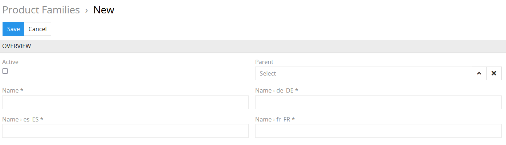
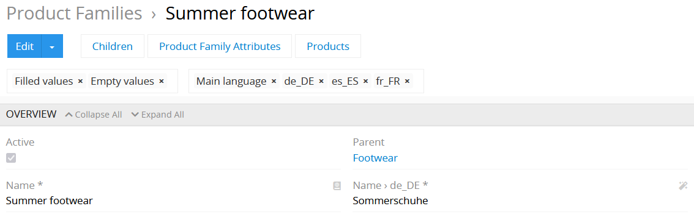
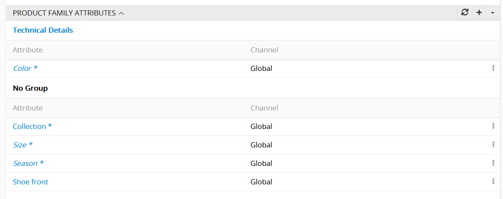
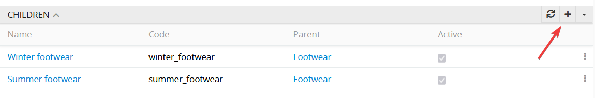
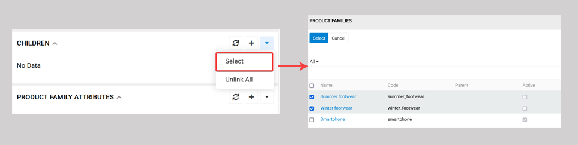
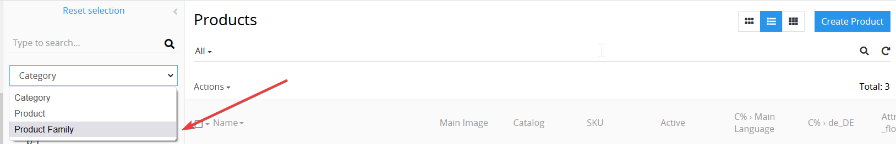

# Advanced Classification

<<<<<<< HEAD
The "Advanced Classification" module allows the user to create product family hierarchies. A product family describes products of same kind with common attributes (features). This module facilitates the product family creation and management as well as product filtering. The module enables you to manage product families that are similar but slightly differ from each other. 

## Product family creation and configuration

To create a new product family go to the `Products / Product family` and click `Create product family` button.
=======
The "Advanced Classification" module allows the user to create product families with hierarchical interconnection. Product family is a group of products with common features defined as attributes. The advanced classification function facilitates product family creation and management as well as product filtering. The module enables you to manage product families that are similar but slightly differ from each other. 

## Product family creation and configuration

To create a new product family go to the `Products > Product family` and click `Create product family` button.
>>>>>>> master

- **Active** – select this checkbox to activate the product family.
<<<<<<< HEAD
- **Name** – specify the product family name. You may also add its translation in the corresponding fields. 
- **Code** - this field should be unique for each product family.
- **Parent** - define the parent element from which this product family will be inherited.

To add fields for additional languages you need to add these additional languages here: "Administration / Languages".

## Product family editing

In order to view the product family details, click on its name in the list. Click the `Edit` button if you need to make any changes.
=======
- **Name** – specify the product family name. You may also add its translation in the corresponding fields. To add more fields for different languages go to `Administration > Languages`.
- **Code** - this field should be unique for each product family.
- **Parent** - define the parent element from which this product family will be inherited.

## Product family editing

In order to view the product family details click on its name in the list. Click the `Edit` button if you need to make any changes.
>>>>>>> master

Below the overview panel you can see children, attributes and products which belong to this particular product family. The inherited attributes are marked with italic font.

<<<<<<< HEAD
The `Children` panel is another way to add hierarchical structure to your product family. You may either create a new product family which will be a child to the current one by clicking the `+` icon.
=======

The `Children` panel is another way to add hierarchical structure to your product family. You may either create a new product family which will be a child to the current one by clicking the `+` icon
>>>>>>> master

or choose from the existing by clicking the `Select` button in the dropdown menu and choose the corresponding product families from the list.

<<<<<<< HEAD
## Inheritance of the product family attributes

All child product families automatically inherit their attribute configuration from the parent product family. These configurations, e.g., whether the attribute is mandatory or not and its scope can still be changed.

## Product family tree

Important! The "Advanced Classification" module enables you to filter your products on the product list page by the product family. On the left panel in the `Product` tab click the dropdown menu and select `Product family`. The tree structure reflecting the product family hierarchy will then be shown. Choose the necessary item, and you're good to go!

=======
## Product filtering

Important! The adv classif module enables you to filter your products by product family. On the left panel in the `Product` tab click the dropdown menu and select `Product family`. The tree structure reflecting the product family hierarchy will then be shown. Choose the necessary item, and you're good to go!

>>>>>>> master
