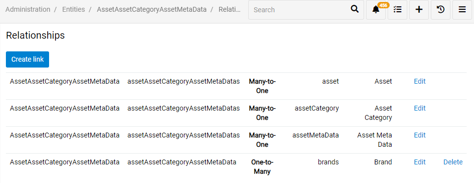
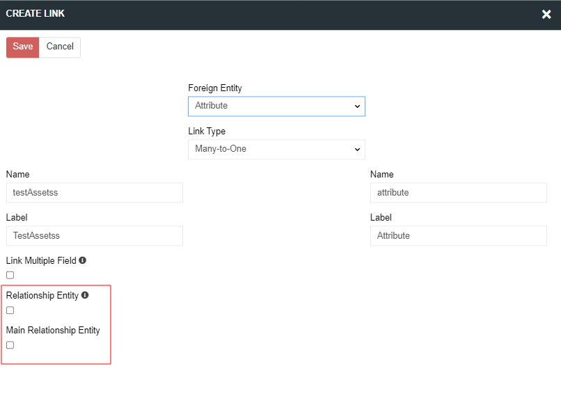

# Advanced data types

"Advanced data types" module allows to add new data types for fields and attributes and adds a new entity type "Relationship".

Included additional data types:

## Alias

Alias – allows to link the attribute value to another attribute value. If the aliased attribute have a value in different scope, the global value will be selected per default. If no global value is available the system will take the value of the first avaiable channel-specific value.

This attribute type should be used if you need to trasfer to some external system, eg some marketplace, your existing attribute values with a different attribute name/code etc. You have an attribute with a code "hat_size" and it needs to be transfered to the amazon marketplace with a code "headdress_size" and maybe a different name.

## Relationship

For the entities Relationship type is added. Use this entity type if you need to create a many-to-many relationship betweeen two entities and assign additional properties to this relation, what is not possible for a standard many-to-many relation. 

A good example could be the entity "Product Channels", which is included in the PIM module. This entity links the entities "Products" and "Channels", so that multiple products can be linked with multiple channels. Additionally for the entity "Product Channels" you have the possibility to activate/deactivate some product for a channel. This checkbox is an additional property for a relationship "Product Channels". The Admin can also add any additional properties, if needed.

To find, create and edit them you can go to `Administration / Entities` page. To create entity press `Create entity` button. To edit existing one select the entity and press `Edit` button.

### Creating and editing Relationship type entity

When creating a "Relationship" type entity, select "Relationship" as a Type. Then, select entities to be related. As you can see on a picture below you need to have at lease two entities to be related. System name for the entity cannot be changed, but you still can change the singular and plural label for this Relationship.

This entity type, like any other entity type allows you enable/disable this entity, set Default Order, Text Filter Fields, etc. 

### Adding new fields

To add additional fields for the entity of type "Relationship" go to `Administration / Entity` and press `Fields` for your entity. You see all the fields that this entity has. Some fields are generated automatically, you cannot edit or delete them. To add a new field click on `Add field` and choose the type for your new field.

### Adding new relations

To add a new relation for your entity of type "Relationship"  go to `Administration / Entity` and press `Relationships`. You will see all relations of this entity. Some relationships are generated automatically, you cannot edit or delete them. They are needed for this entity type. To add a new Relationship press `Create link`.

If you select the Many-to-One link type, two additional checkboxes appear on the link creation page:
- `Relationship Entity` - check this option to mark the foreign entity as the target entity for a relationship. All target entities together build up a unique index
- `Main Relationship Entity` - check this checkbox to mark this foreign entity as the primary entity from which the relative entity should be viewed. Only one of the foreign entities can be selected as the main one.

