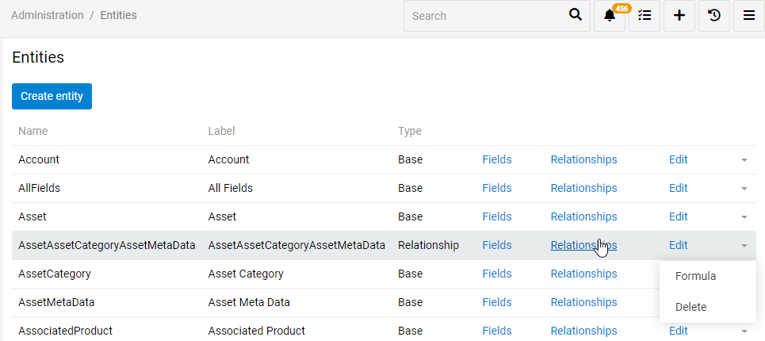
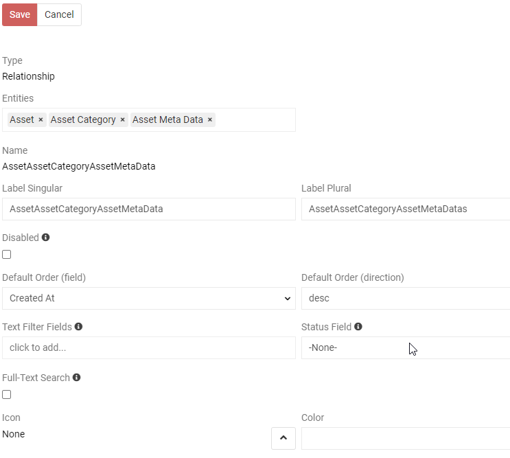
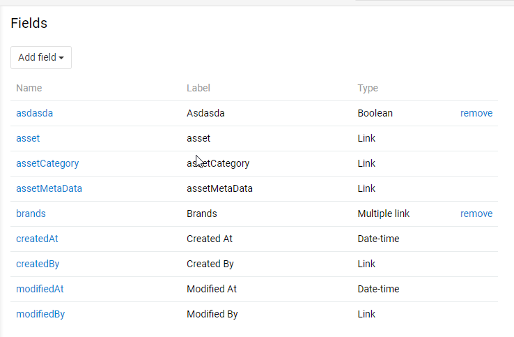
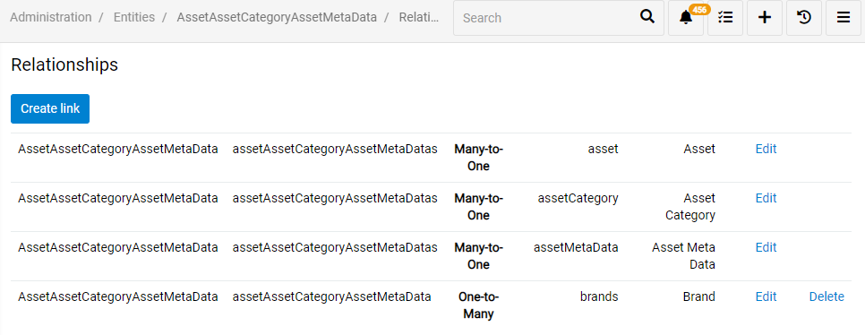

# Advanced data types

`Advanced data types` module allows to add new data types for fields and attributes. You can see this module in Administration/Modules menu and find additional field types when editing entities in Administration/Entities menu.

Included additional data types:

## Alias

`Alias` - Allows to have a link to another attribute.

## Relationship

For the entities `Relationship` type is added. It helps building custom entities that connect existing ones. To find, create and edit them you can go to `Administration/Entities` page (see picture below). To create entity press `Create entity` button. To edit existing one select the entity and press `Edit` button.

### Creating and editing Relationship type entity

When creating a `Relationship` type entity, select `Relationship` as a `Type`. Then, select what entities will be related. As you can see on a picture below you can have more then one entity in this relationship. Entity will be set as combination of selected entities as well as default label. Still, you can select another label.

As well as the other types of entities you can disable this one, set `Default Order`, `Text Filter Fields`, ets (see picture below). 

### Adding new fields to Relationship type entity

You can also create additional fields to this entity. To do so, press `Fields` button on `Administration/Entities` page. On the picture below you can see all the fields that this entity has. Some fields are generated automatically - you cannot edit or delete them. They are needed for this entity type. Still, you can add your custom fields. As you can see in this example we have already added some fields. Your custom fields are added the same way as in any other entity types.

### Adding new relationships to Relationship type entity

You can also create additional relationships to this entity. To do so, press `Relationship` button on `Administration/Entities` page. On the picture below you can see all the relationships that this entity has. Some relationships are generated automatically - you cannot edit or delete them. They are needed for this entity type. Still, you can add your custom relationships. As you can see in this example we have already added some relationships. Your custom relationships are added the same way as in any other entity types.

