# Advanced data types

"Advanced data types" module extends the capabilities provided by the standard PIM and Core modules. It allows to manage entities of type Relation, provides additional data types and the ability to convert attributes to other types, as well as create dynamic selections.

## Relation entity type

When you create a many-to-many relationship between two entities, an entity of type Relation is automatically created in the entity manager. The entity name is formed by combining the names of the two entities that form it. By default, the entity has two fields of the link type, which refer to the related base (or hieararchy) entities, as well as the fields id, created/modify at and created/modify by. The Advanced Data Types module provides the ability to edit, configure entities of type Relation and display it as a menu item. If you have this module installed, you can perform the same actions on a Relation entity as you would on a base or hierarchy entity. You can assign additional properties to Relation entity: add new fields, change labels, select Text Filter Fields, Default Order and create new links with other entities.

A good example could be the entity "Product Channels", which is included in the PIM module. This entity links the entities "Products" and "Channels", so that multiple products can be linked with multiple channels. Additionally for the entity "Product Channels" you have the possibility to activate/deactivate some product for a channel. This checkbox is an additional property for a relation "Product Channels". The Admin can also add any additional properties, if needed.

To find, create and edit entity you can go to `Administration / Entities` page. To create entity press `Create entity` button. To edit existing one select the entity and press `Edit` button.

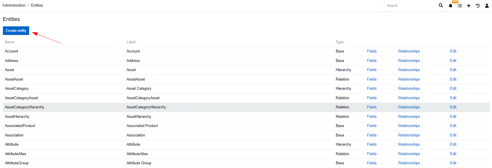

### Adding new relations

To add a new relation for your entity of type "Relationship"  go to `Administration / Entity` and press `Relationships`. You will see all relations of this entity. Some relationships are generated automatically, you cannot edit or delete them. They are needed for this entity type. To add a new Relationship press `Create link`.

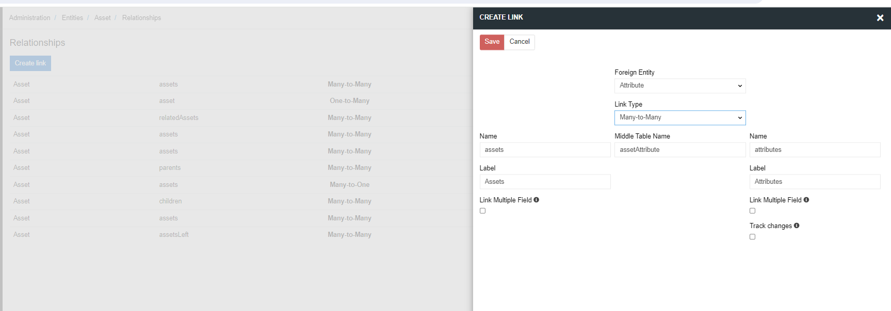

For entity of type Relation it is possible to create only many-to-one link with another entity.

### Adding new fields

To add additional fields for the entity of type "Relation" go to `Administration / Entity` and press `Fields` for your entity. You see all the fields that this entity has. Some fields are generated automatically, you cannot edit or delete them. To add a new field click on `Add field` and choose the type for your new field.

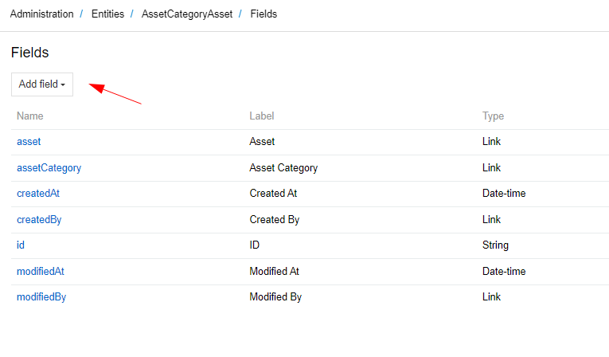

### Setting permissions for an entity of type Relation

An entity of type relation inherits the permissions from the two entities it consists of. That is, if the user has permission to create, read and edit the ProductChannel entity, but editing is prohibited for one or both entities (Channel and Product), then the user will not be able to edit the ProductChannel entity either. Thus, in order to have permission to perform some action with an entity of the Relation type, the user must be allowed this action for both the entities that form it, as well as for the Relation entity itself.

To configure permissions for a specific user, you need to add a role to the user and configure the permissions for that role in `Administration / Roles`

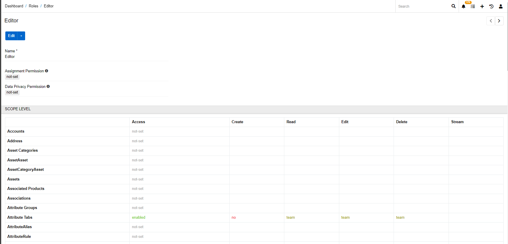

## Attributes of type alias

Alias – allows to link the attribute value to another attribute value. If the aliased attribute have a value in different scope, the global value will be selected per default. If no global value is available the system will take the value of the first avaiable channel-specific value.

This attribute type should be used if you need to trasfer to some external system, eg some marketplace, your existing attribute values with a different attribute name/code etc. You have an attribute with a code "hat_size" and it needs to be transfered to the amazon marketplace with a code "headdress_size" and maybe a different name.

## Attributes of type link and link multiple

The link type attribute allows you to add any field of another entity to the product as a link. By clicking on the value of this attribute, you can go to the entity whose field it refers to. When creating an attribute of type link, you need to select the entity to which it refers and its field, which should be displayed as the attribute value.

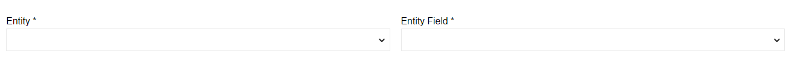

For the type of link multiple, you can choose many records of the linked entity. 

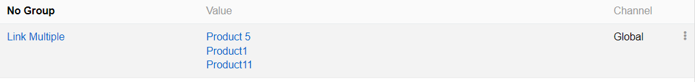

## Attribute of script type

For some attributes you may need a value that consists of modified (or not) pre-existing values. For this attribute of script type may be needed. 
Scrips are based on twig code (for more detailed information regarding twig syntaxes please go to https://twig.symfony.com/). 

First, you need to select a desired output for the script:
 
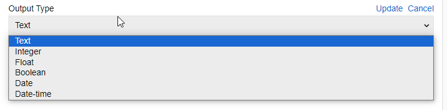

Then, by using Twig write a script:
 
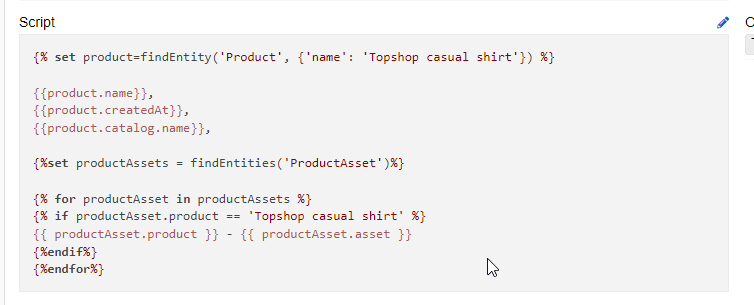

To see what the script does you can look at "Script value" field. It selects a random product attribute value from products that the script is assigned to.
 
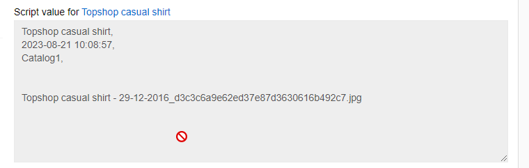

### Here are some examples of what you can achieve by using attributes of script type:

#### Selecting values for specific product
 

This script finds if the product name is 'Topshop casual shirt' 

    
and selects fields name 

    {{product.name}}, createdAt {{product.createdAt}} 
and the name of an assigned catalog 

    {{product.catalog.name}}
Then it finds all assets assigned to the product

     
and selects the name of a product in this asset 

    {{ productAsset.product }} 
and an asset in this asset 

    {{ productAsset.asset }}.

#### Referencing other attribute value

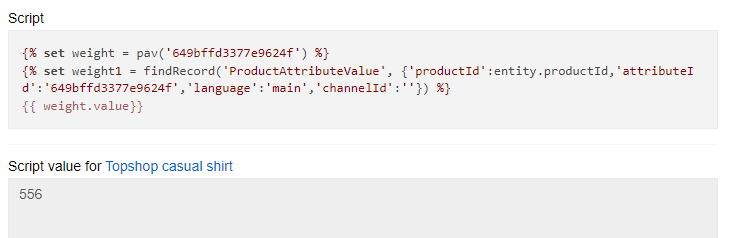

Here are two options how you can refer to another attribute value. The both find an attribute by Id. Option one is restricted to only current product (though you can select language and scope. If not selected they are 'main language' and 'Global'). The second finds any entity by all its defining fields (for ProductAttributeValue they are productId, attributeId, language and channel).

#### Using conditions

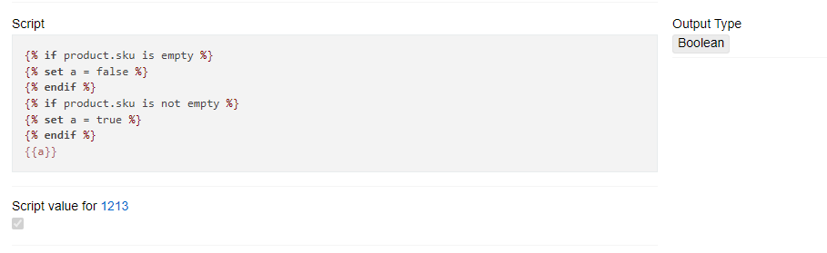

You can use conditions for scripts. This script finds if the product SKU is empty or not and checks a mark if it is. 
The script type can be used for both fields and attributes.

## Dynamic Relations

This functionality was created to improve the technique of connecting entities to each other. It allows you to quickly link two entities without physically creating a table in the database.

For example, let's say we have a database of 3 million products and we want to select all products that contain 'Apple' in the name and assign them to the Apple category. If you connect all the records directly, it will take a long time. And if the selection will change over time, it will be irrational. The Dynamic selection panel allows you to get the desired relations instantly and synchronize it with an external channel. When the condition changes, a new selection will also be received immediately, which will significantly save time for creating connections.

This mechanism works one-way, that is, the selection can be constructed from the point of view of one entity (Category in this example) and cannot be interpreted from the point of view of another (Product). But PIM also implements a caching mechanism that allows you to configure the creation of a job that will create a physical connection based on a dynamic one.

To create new Dynamic Relation click on `Create Dynamic Relation` button. You will see next menu

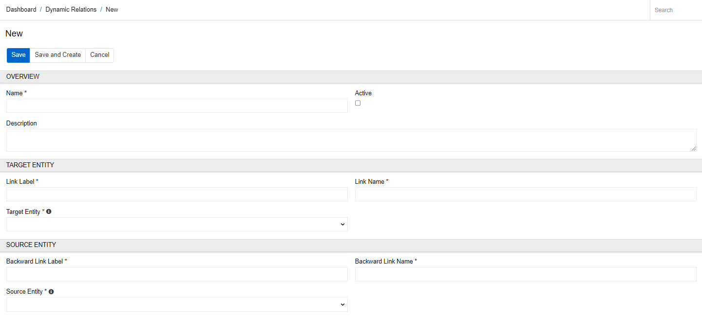

- **Active** – select this checkbox to activate the Dynamic Relation.
- **Name** – specify the Dynamic Relation name
- **Target Entity** – the entity to show the panel with dynamically filtered records from the Source Entity
- **Source Entity** – the entity to apply search filters for
- **Link Label** - the title of dynamic selection panel on target entity page 
- **Backward Link Label** - the title of panel on source entity page 

Click '+' on Dynamic Selection panel. You will see next menu

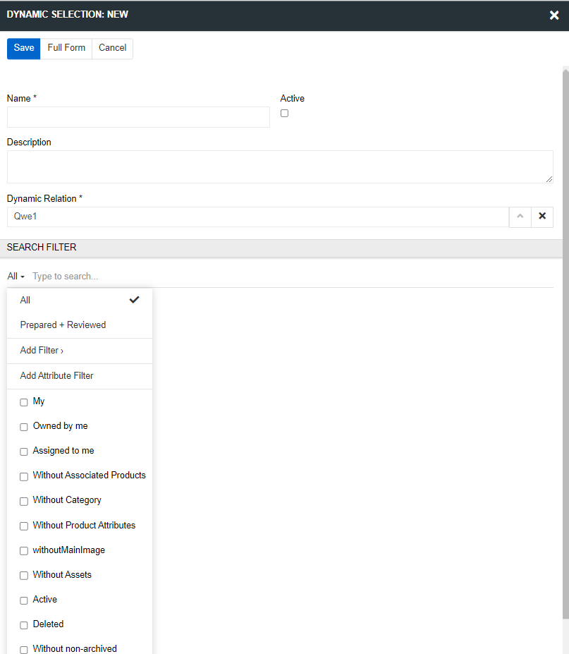

You can create a dynamic selection from relation or go to Dynamic Selection page and click on `Create Selection`. 

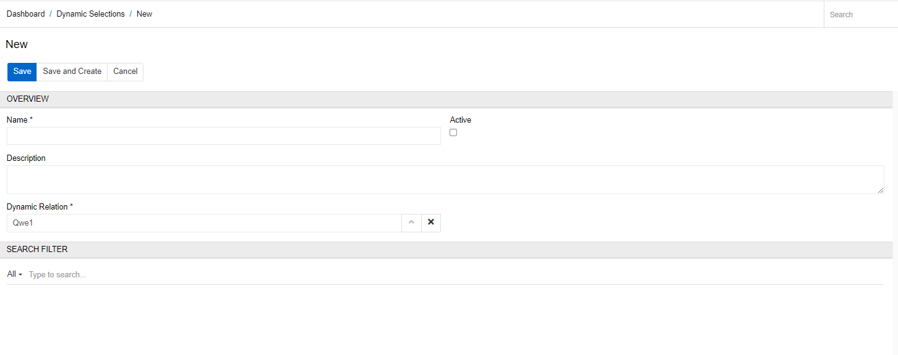

On this page you should create a name for the new selection, choose Dynamic Relation and add a search filter for the source entity. In the following example, we selected all products that contain '11' in the name and linked them to a category 'new test'. 

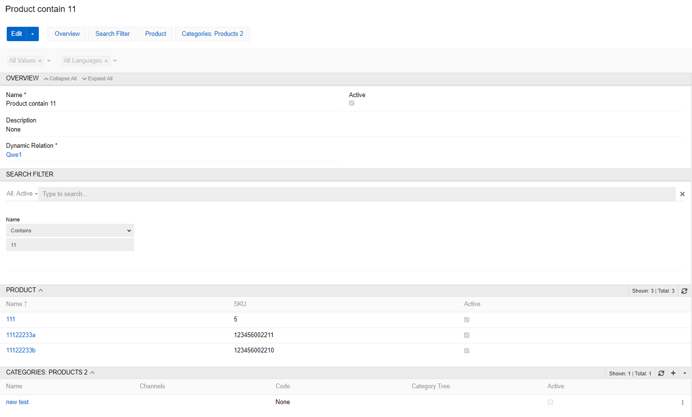

Now on the Сategory page you can add the Products 2 panel in the layouts (the name you chose as the Link Label) and for new test category it will display the selected products.

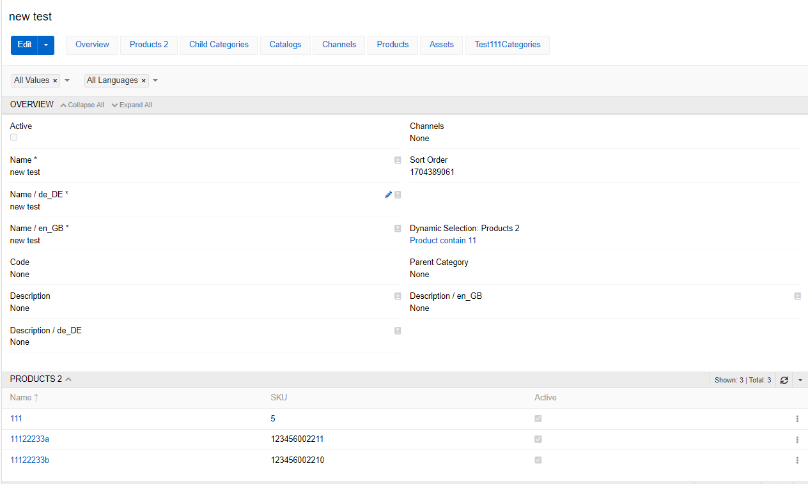