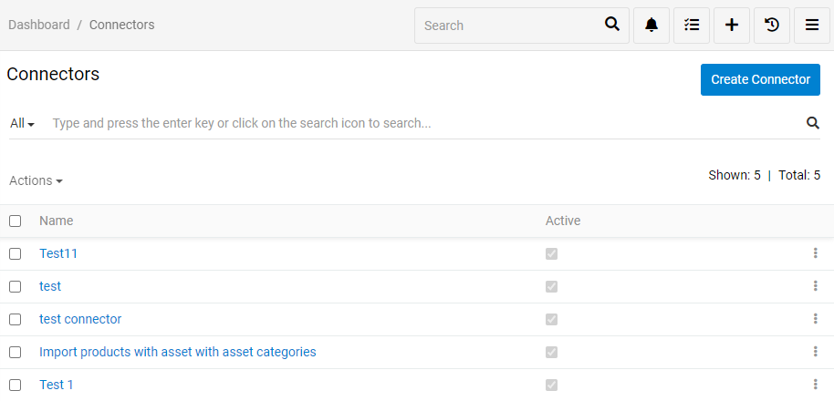
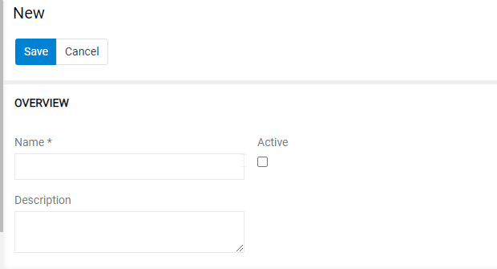
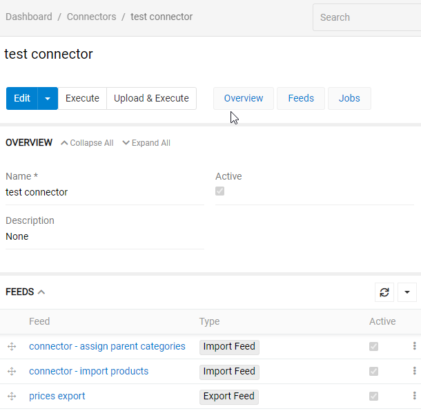
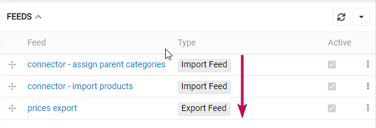
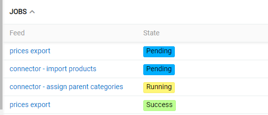
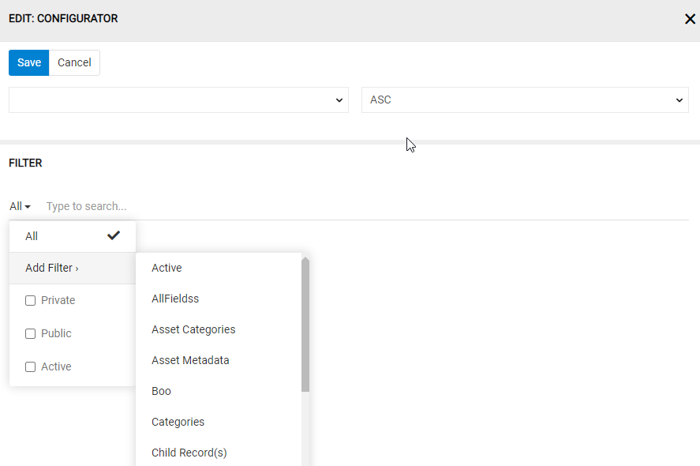
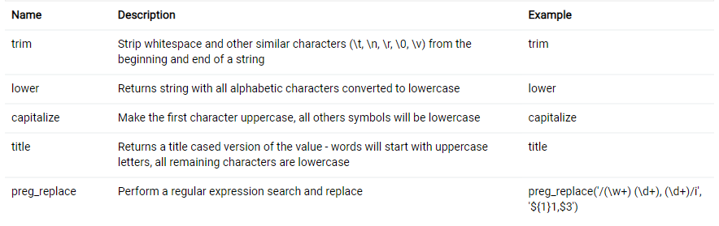
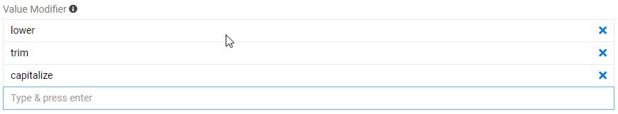
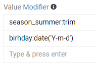
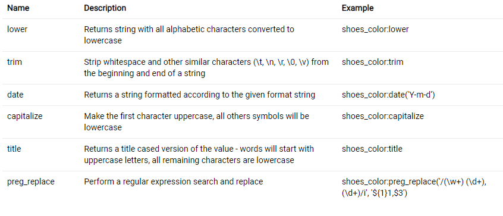

# Connector

The "Connector" module allows you to orchestrate multiple import and export feeds, of any type. Ypu can set the sort order for the execution of your feeds, run the sequence automatically as a scheduled or event-based job, or manually, in just one click. Also it adds additional functions to export and import feeds.

## Main functions

The "Connector" module was created primarily to be used together with Export and Import feeds, so further description of the module is given in the context of them.

Menu item "Connectors" should be added by your Administrator. From there you can see all existing connectors, edit them, delete or create new.

### Creating Connector

To create a connector click `Create Connector` button. You will see next menu

Set the name, description and press the checkbox if you want it to be active. Then press `Save`. The menu next is the same as editing menu.

### Editing Connector

In the `Feeds` section you can add or unlink export or import feeds. To add one press arrow and select `Select: Import Feed` or `Select: Export Feed` for import and export feeds apparently. To unlink one press tree dots and select `Unlink`.

You can also change the order of feeds to benefit your task. To do so, just grab and pull the feed.

### Running connector jobs

<!-- TODO помоєму рома зробив, що зараз виконання може продовжитись, навіть, якщо попередній фід виконався з помилкою, це треба доописати -->
To execute all import and export jobs assigned to a Connector press `Execute` button. This will launch all the feeds you selected in `Feeds` section. The order of the feeds launched will be from the top feed down to the last. So, when and only when a previous feed is successfully executed, a new one will start and so on to the last. If a result of a job is an error a new feed is not started and cancelled.

This will make sure your intent is achieved.

## Additional functions

"Connector" module also has some additional functions to help ypu export and import more flexible. It includes additional filtering and value modifiers.

### Additional filtering

You can filter by related fields (even one you do not export). This includes all filters you can apply by using filter in main system.

### Value Modifiers

You can modify data from your PIM database for a better user experience. Possible modifiers are:

- **trim** – deletes extra spaces and program symbols from the information (from " La/Maison" to "La Maison")
- **lower** - converts all uppercase letters to lowercase (from "LA MAISON" to "la maison")
- **capitalize** - converts first letter from the information to uppercase (from "la maison" to "La maison")
- **title** - converts all first letters to uppercase (from "la maison" to "La Maison")
- **date**  - converts data values to appropriate format (it is set in Angle brackets after date)
- **preg_replace** - custom formulas for your data

> When processing modifiers, the system applies them from top to bottom. So, in the example below you can change from " LA MAISON" to "La maison".

When exporting attribute values, for better display of the values you would like to modify data. To do so, in `CONFIGURATOR` for value fields ve have `Value Modifier`. As you can see on a picture below it can have multiple modifiers for multiple values. Any value can have more then one or no modifier. Value codes are used for this in formulas (see picture below).

Modifiers, their description and examples are in the table under the `Value Modifier` as the one you can see on the picture below.

> When exporting attribute values, you can also modify them, but, because one entity can have different attributes, attribute modifiers have to be written in formulas.

