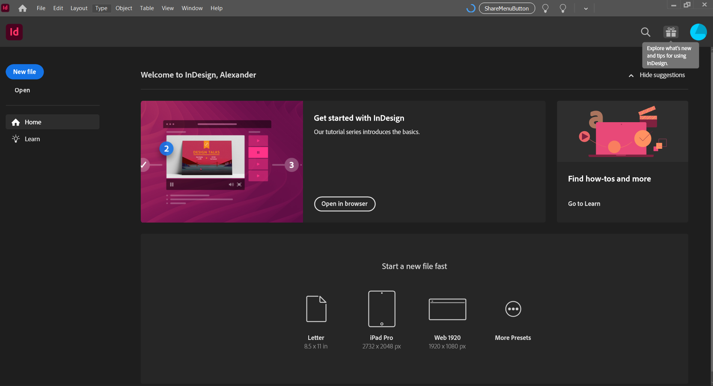
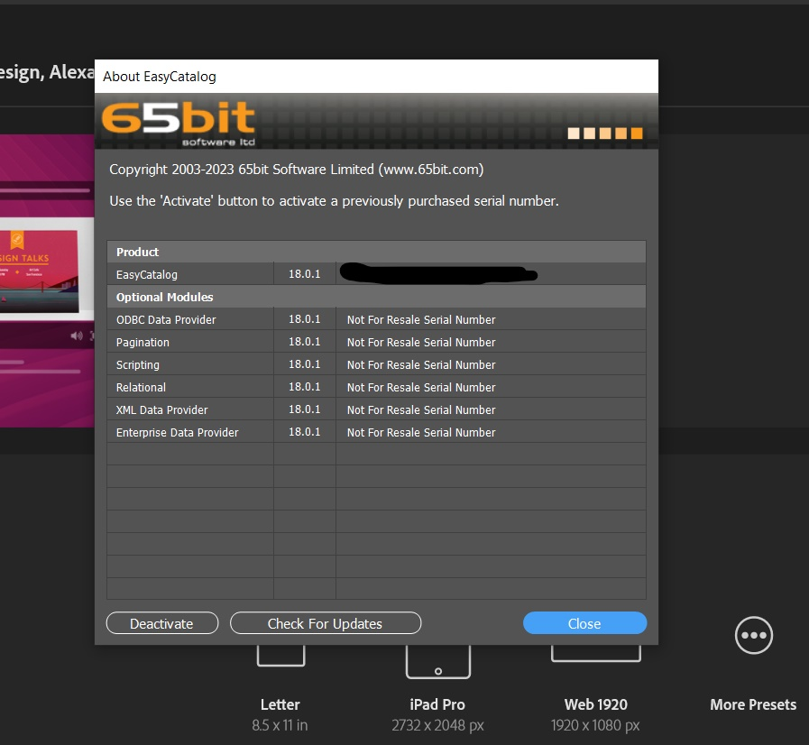
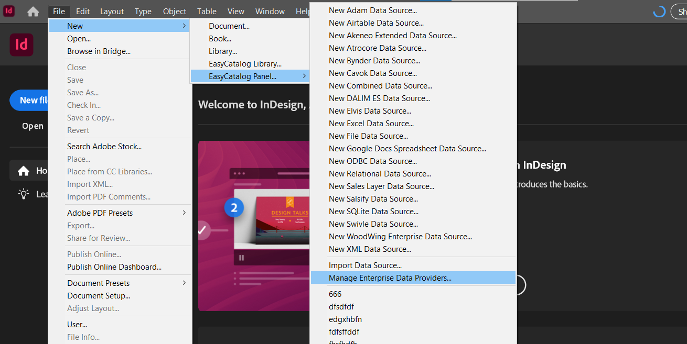
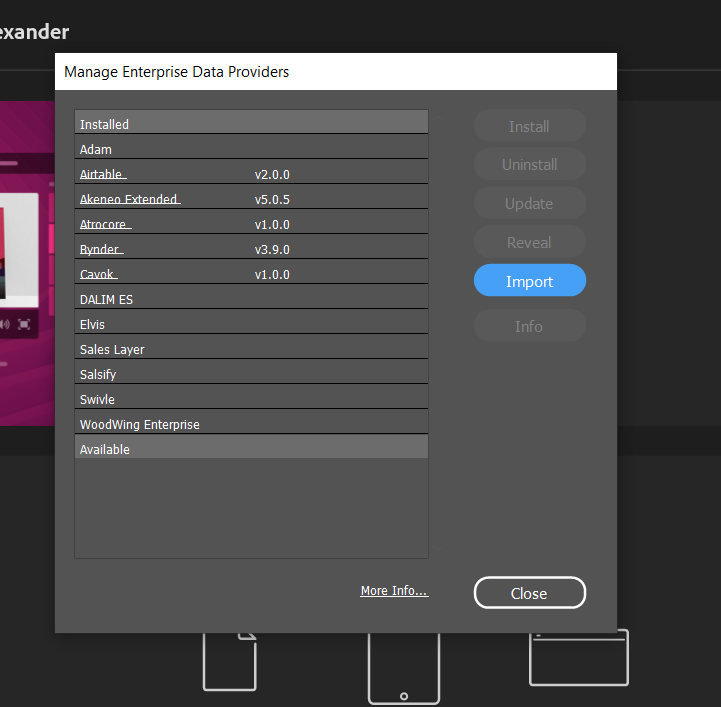
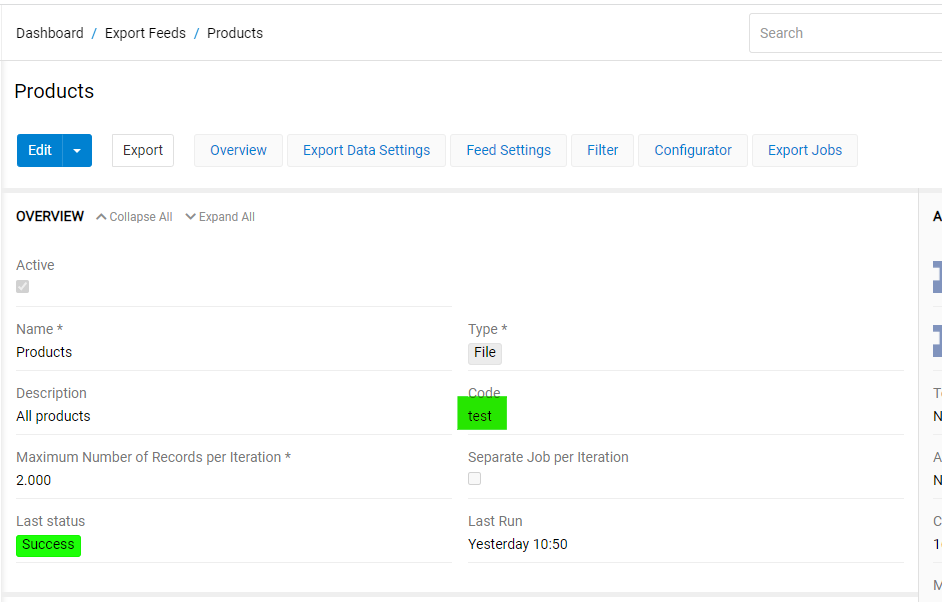
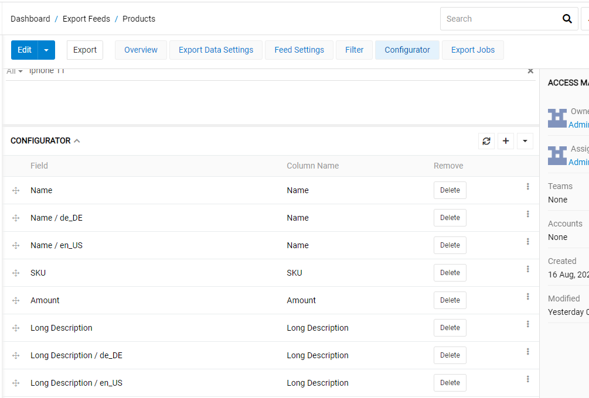
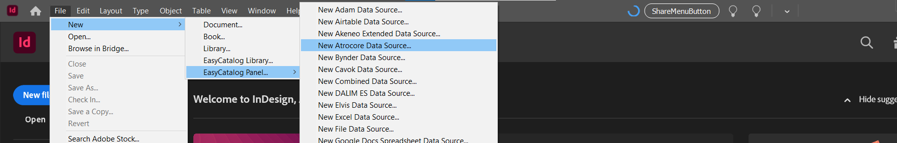
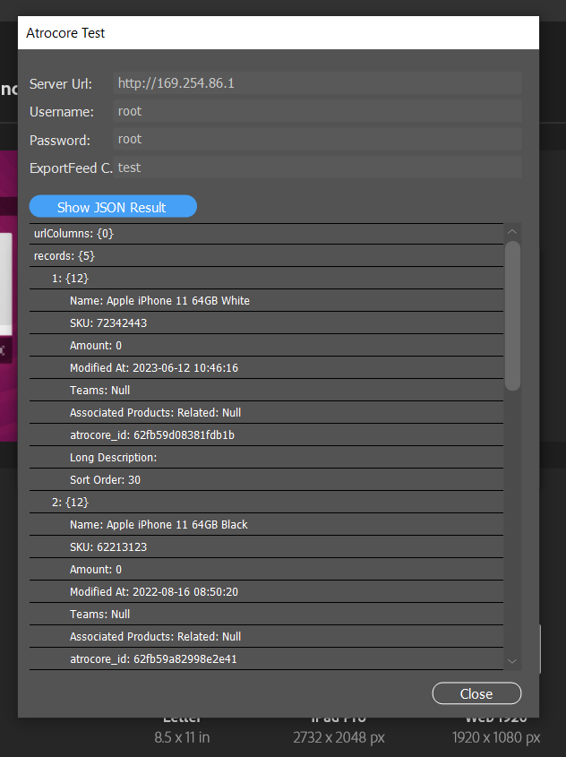
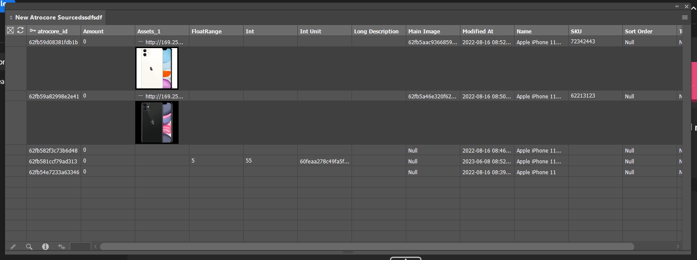

# Easy Catalog Adapter

The Atrocore Plugin for Easy catalog is a lua script that will connect to atrocore and pull data from export feed module

## Install InDesign

Download the setup from https://helpx.adobe.com/fr/indesign/get-started.html.
You need to have an adobe account to launch InDesign

## Install Easy Catalog Plugin For InDesing

Download Setup for you Indesign version on this page https://www.65bit.com/download/reg/.
After installation, launch InDesign, you will have to put a license key and you will have the screen below

## Install Adapter in InDesign

In the File menu, go to New -> EasyCatalog Panel -> Manage Enterprise Data Providers.

Click on Import Button and select the script atrocore.lua on your local machine.
After that the adapter is installed.

## Configure Feed on PIM side

On any export feed you have to put a value in the field "Code" (this value is unique in the system).
This information will be specified in the configuration of a new easycatalog data source.

You have to use the configurator to chose what field you want to send to easy catalog.

## Configure a new Data Source on EasyCatalog

Create a new datasource.

Enter valid information in the form.

You can test your configuration by clicking on test button and see the response from pim.

Click Ok on the form to get data from pim and create a new easy catalog panel.

