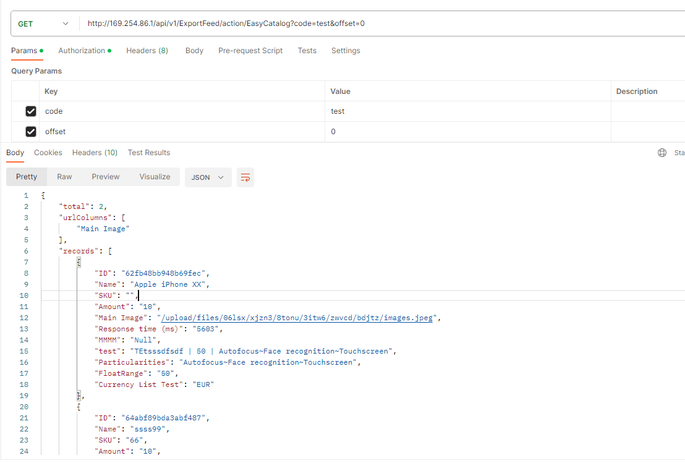
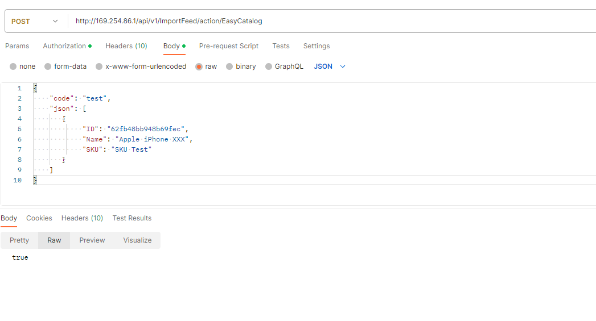

# EasyCatalog: Rest API

For EasyCatalog Integration, there are 2 rest apis that are available to export and import data, one in `Import Feeds` and the other in `Export Feeds`.

## Rest api in `Export Feeds`

To use this api, you need an active exportFeed with a valid code. Then you can do a `GET` request to `/api/v1/ExportFeed/action/EasyCatalog?code=ExportFeedCode&offset=0`.
This will return data configured in the ExportFeed.

## Rest api in `Import Feeds`

To use this api, you need an active importFeed with a valid code. Then you can do a `POST` request to `/api/v1/ImportFeed/action/EasyCatalog`. 
The body has to contains 2 parametedrs
Although you import by dHTTP protocol you will still need an example file for configurator to figure HTTP Request out. Use it as your guiding hand and select any of the standard file type. Then proceed as normal up to `Request Offset` option.

- `code` – the importFeed code
- `json` – an array of object that contains values to update

