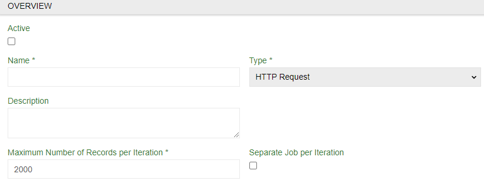
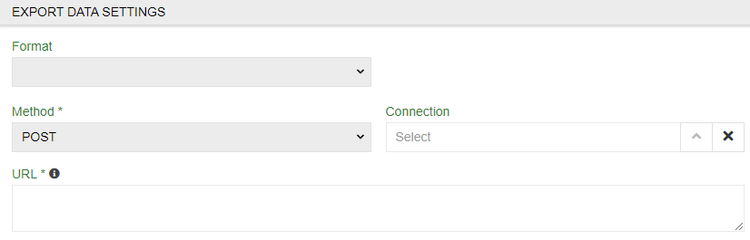
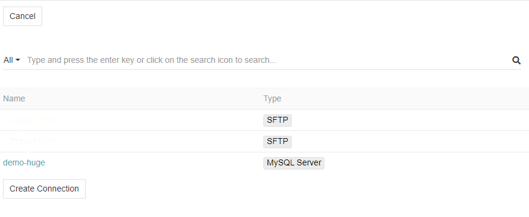

# Export Feeds: HTTP Request

When you don't want to export files every time and upload them to the web you may use `Export Feeds: HTTP Request` module. It will expot data from to you provide using HTTP protocol in appropriate form.

> Note that you will still need `Export Feeds` module to import anything.

## Creating HTTP Request feed

To create export feed using HTTP Request select `HTTP Request` as a `Type`. You may need to adjust `Maximum Number of Records per Iteration *` option or leave it default. Then proceed as normal up to `FEED SETTINGS` tab.

## FEED SETTINGS tab

Select a format you want data to be exported in. Ypu can use CSV, XLS, JSON or XML. For JSON or XML there is a `Template` to be set. After that fill the required fields.

- `Method *` – select request method
- `Connection ` – select established connections or create a new one
- `URL *` – select url where request will go. For some goals you may need dynamic URLs. To do this first adjust `Maximum Number of Records per Iteration *` to 1. It will make feed to do separate job for each record. Then write a dynamic URL here.

### Connection menu

Here you can select established connections or create a new one. Use name, `Host` and `Port` to locate it and  `User` and `Password` (of your database) for the system to get access to it.

