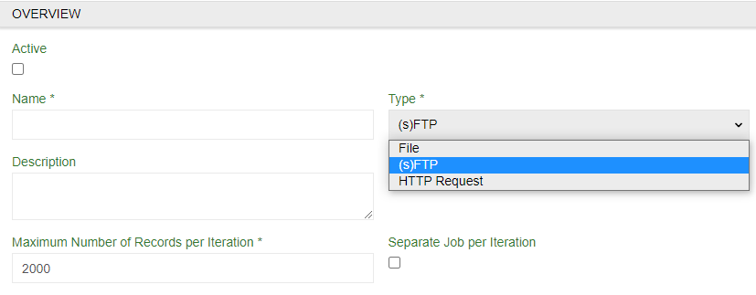
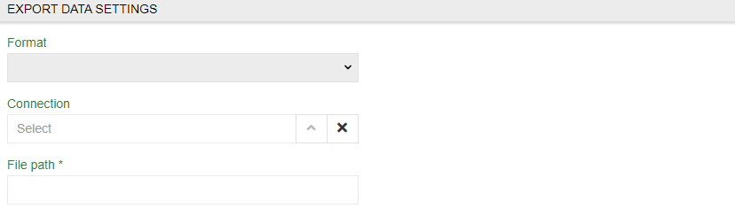

# Export Feeds: Remote File

This module extends the functionality of the module Export Feeds and enables you to automate export process by storing your exported files to a certain location on any (s)FTP Server.

> Note that you will still need `Export Feeds` module to be installed.

## Creating Remote File feed

To create remote file export feed select `(s)FTP` as a `Type`. 
You may need to adjust `Maximum Number of Records per Iteration *` option to limit the amount of records to be exported to one file. 

## Export Data Settings

Select a format you want data to be exported in. You can select CSV, XLS, JSON or XML. For JSON or XML there is a `Template` to be defined. After that fill the required fields.

- `Connection ` – select established connections or create a new one
- `File path *` – select url where request will go.

### Connection menu

Here you can select established connections or create a new one. Use name, `Host` and `Port` to locate it and  `User` and `Password` (of your database) for the system to get access to it.

