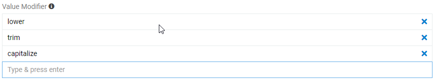
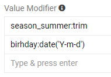
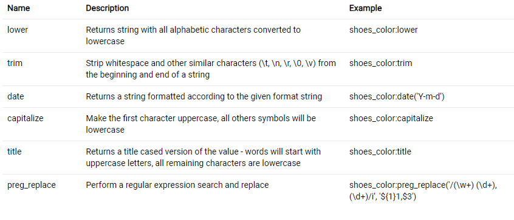

# Export Feeds

The "Export Feeds" module enables the use of export feeds in a user-friendly manner. In general, *export feed* is a data export template that depends on the user needs and entity data to be exported from the AtroPIM system.

With the help of the "Export Feeds" module, data export from the AtroPIM system is performed in accordance with the export templates that can be further configured and customized, as well as reused at different time intervals.

## Administrator Functions

The "Export Feeds" module significantly extends the functionality of the AtroPIM system, so further description of the module is given in the context of AtroPIM.

After the module installation, a new `Export Feeds` configuration group is added to the AtroPIM administration page. Also there is a possibility to add export feeds as a separate navigation menu item on the `Administration > User Interface` page:

The "Export Feeds" module also supports transferring export feeds data of separate channels. To enable the display of the export feeds linked to separate [channels](#channel-export-via-export-feeds), add the corresponding bottom panel in the Layout Manager via its drag-and-drop:

## The following modules extend the functionality of the export feeds

- Export Feeds: HTTP Request – the module allows to export data via HTTP request.
- Connector – orchestrates multiple import and export feeds to automate the complex data exchange
- Export Feeds: Remote File - the module enables to automatically or manually export data to a file on a FTP, sFTP or SSH server.
- Translations – adds a functionality of the imported data automated or manual translation.

## Export Feed Creation

To create a new export feed, go to the `Administration > Export Feeds` page or click `Export Feeds` in the navigation menu and then click the `Create Export Feed` button. The common creation pop-up will appear:

Here enter the export feed name, select its type and define its owner. By default, the export feed type is **File**. In case you need to export the data to the other sources, the corresponding modules installation is required.

You may also set up your export feed in the `Export Data Settings` panel and in the `Feed Settings` panel:

In the `Export Data Settings` panel you should specify the format of the file where the data will be exported. The available formats are **CSV** and **Excel**.

In the `Feed Settings` panel you may set up the following values:

- **Entity** – from the drop-down list of entities available in the system select the desired entity type, for which this export feed will be used.
- **Thousand separator** –  define the symbol, which is used as thousand separator. This parameter is optional. The numerical values without thousand separator will be also imported (eg both values 1234,34 and 1.234,34 will be imported, if "." is defined as a thousand separator).
- **Decimal mark** – select the used decimal mark, usually `.` or `,` should be defined here.
- **Empty Value** – This symbol will be interpreted as "empty" value additionally to the empty cell, eg "" and "none" will be interpreted as "", if you define "none" as an empty value.
- **Null value** – this value will be interpreted as "NULL" value.

Click the `Save` button to complete the operation; the new record will be added to the export feeds list. You can configure it right away on the detail view page that opens or return to it later.

## Export Feed Configuration

To configure the export feed, click the desired record in the export feeds list; the following detail view page will open:

In-line editing is supported here. So prior to making any changes, you have to click the pencil icon located on the right of each editable field.

*For details on in-line editing and other features of the AtroPIM system, refer to the **Entity Records** section of the [**Views and Panels**](../atropim/user-guide/views-and-panels.md) article of our user guide.*

### Overview panel

Overview panel enables you to define the main feed parameters (name, action, activity etc):

The following settings are available here:

- **Active** – select this checkbox to activate the export feed. If the export feed is not activated, the exporting feature will be disabled for it.
- **Name** – export feed name.
- **Description** – enter the description of the export feed usage, i.e. what data and in what form they are exported, as a reminder for the future. This field is not required.
- **Type** – the export feed type defined on its creation only; it cannot be modified.
- **Amount of "Success" Export Jobs to be stored** – you may specify how many successful export jobs you want to be stored in your system.
- **Maximum Number of Records per Iteration** - here enter the maximum number of rows to be exported at a time.
- **Separate Job per Iteration** - check if each iteration should be performed in a separate export job.

### Export Data Settings

- **File format** – from the drop-down list select the file type – CSV or XLSX (Excel) – in which the data export will be performed. 
- **Header row** – leave the checkbox activated to include the column names in the export file or remove its selection to skip column names from exporting.

When the SCV file format is selected, the following settings are added to be configured via the drop-down lists:
- **Field delimiter** – select the preferred field delimiter to be used in the export file: `;`, `,`, `\t`, `|`.
- **Text qualifier** – select the preferred separator of the values within a cell: single or double quotes.

Please, note that by default the XLSX (Excel) file format is set and the `Header row` checkbox is activated.

### Feed Settings

The export file parameters are configured on the `FEED SETTINGS` panel:

- **Entity** – from the drop-down list of entities available in the system select the desired entity type, for which this export feed will be used.
- **Language** - this value is inherited by creating a rule for some language specific attribute and has no impact on export itself.
- **Thousand separator** –  define the symbol, which is used as thousand separator. This parameter is optional. The numerical values without thousand separator will be also imported (eg both values 1234,34 and 1.234,34 will be imported, if "." is defined as a thousand separator).
- **Decimal mark** – select the used decimal mark, usually `.` or `,` should be defined here.
- **Empty Value** – This symbol will be interpreted as "empty" value additionally to the empty cell, eg "" and "none" will be interpreted as "", if you define "none" as an empty value.
- **Null value** – this value will be interpreted as "NULL" value.
- **Convert collection to string** - check if the fields and attributes of type: multi-enum, array, one-to-many relation should be converted to string.
- **List Value Separator** - specify the mark for dividing the values of the list.
- **Convert relations to string** - check if the relations of the exported entity should be converted to string.
- **Field Delimiter for Relation** - specify the mark for separating the relations.
- **Mark for a not linked attribute** - specify how a not linked attribute should be labeled.

#### Filter

The AtroPIM system allows you to export a specific range of product data, which can be defined on the `PRODUCTS FILTER` panel. Here you can build filters by categories linked to the product, entity fields of the product itself, and by product attributes and their values:

You can save the created filters for their further use for exporting the data.

Filtering settings for export feeds are the same as for product list view. However, the list of filters can be modified in the Layout Manager on the `Search filters` layout for the `products` entity:

### Configurator

The configuration of the entity fields is performed on the `CONFIGURATOR` panel on either the detail or edit view page of the export feed. By default, the required fields of the entity type defined on the `SIMPLE TYPE SETTINGS` panel are displayed there, and depending on this choice, the `CONFIGURATOR` panel contains different fields. For [Products](../atropim/user-guide/products.md), this panel looks as follows: 

Here you can change the entity field name to be displayed in the export file by entering the desired value in the corresponding `Column` text box:

Changing the field order to be displayed in the export file is also done here via drag-and-drop:

Use the `Remove` button to remove the desired field from the export file.

To add more entity fields for export, select the `Add entity field` option from the adding drop-down menu; the following pop-up will appear:

Here select the field from the drop-down list of all fields available in the system for the given entity, modify the `Column` value, if needed, and define whether data export should be made by ID or code (for those fields, where this option is available). 

If the field you export has more than one value you can select how many of them you will export by using `Limit` and `Offset` values. `Offset` shows from what serial number to start counting (note that the first value has a serial number of 0). `Limit` shows how many values to export. For example, Offset 5 `Limit` 1 will export only one (6th) value. 
When used by default these values will select all applicable results.

 

You can modify data from your PIM database for a better user experience in the exported file. Modificators are:

- **trim** – deletes extra spaces and program symbols from the information (from " La/Maison" to "La Maison")
- **lover** - converts all uppercase letters to lowercase (from "LA MAISON" to "la maison")
- **capitalize** - converts first letter from the information to uppercase (from "la maison" to "La maison")
- **title** - converts all first letters to uppercase (from "la maison" to "La Maison")
- **date**  - converts data values to appropriate format (it is set in Angle brackets after date)
- **preg_replace** - custom formulas for your data

> When processing modifiers, the system applies them from top to bottom. So, in the example below you can change from " LA MAISON" to "La maison".

When exporting attribute values, for better display of the values you would like to modify data. To do so, in `CONFIGURATOR` for value fields ve have `Value Modifier`. As you can see on a picture below it can have multiple modifiers for multiple values. Any value can have more then one or no modifier. Value codes are used for this in formulas (see picture below).

Modifiers, their description and examples are in the table under the `Value Modifier` as the one you can see on the picture below.

> When exporting attribute values, you can also modify them, but, because one entity can have different attributes, attribute modifiers have to be written in formulas.

For the `Product categories` field there is also the ability to choose its scope level:

If the `Channel` scope level is defined, also select the required channel to be used for product categories in the corresponding field. 

The "Export Feeds" module also allows you to export product attribute values. They can be added to the export feed on the `CONFIGURATOR` panel via the `Add product attribute` option from the adding drop-down menu:

In the creation pop-up that appears select the attribute from the list of the existing attributes and define its scope level – global or channel. The `Column` field is filled in automatically depending on the selected options:

Alternatively, you can enter a different `Column` name via the keyboard.

Both entity field and product attribute records added to the export feed can be edited via the corresponding option of the single record action menu:

Click the `Remove` button to delete the corresponding added entity field or product attribute record.

## Export Feed Operations and Actions

Export feed records can be duplicated and removed whenever needed.

To *duplicate* the existing export feed record, use the corresponding option from the actions menu on the desired export feed record detail view page:

You will be redirected to the export feed creation page and get all the values of the last chosen export feed record copied in the empty fields of the new feed record to be created. 

In order to *remove* the export feed record, use the corresponding option from the actions menu on the desired export feed record detail view page or from the single record actions menu on the export feeds list view page:

To complete the operation, click the `Remove` button in the confirmation message that appears.

The "Export Feeds" module also supports common AtroCore *mass actions* that can be applied to several selected export feed records, i.e. records with set checkboxes. These actions can be found in the corresponding menu on the export feeds list view page:

- **Remove** – to remove the selected export feed records (multiple deletion).
- **Merge** – to merge the selected export feed records.
- **Mass update** – to update several selected export feed records at once. To have a longer list of fields available for mass updating, please, contact your administrator.
- **Export** – to export the desired data fields of the selected export feed records in the XLSX or CSV format.

### Access Rights

To enable export feed creation, editing, usage and deletion by other users, configure the corresponding access rights to the `Export feeds` entity for the desired user / team / portal user role on the `Administration > Roles > 'Role name'` page: 

To enable the use of export feeds from channels, configure at least reading rights for the `Channels` entity on the same page.

## User Functions 

After the "Export Feeds" module is installed and configured by the administrator, user can work with export feeds in accordance with his role rights that are predefined by the administrator.

To start exporting the data via the active export feed, click the `Export now` button on its detail view page or use the `Export now` option from the single record actions menu on the "Export feeds" list view page:

When export is started, its details and current status are displayed in the Queue Manager pop-up that appears automatically:

After the successful data export, you can download the exported file right from the Queue Manager or close the completed export task.

### Channel Export via Export Feeds

If an active channel contains one or several export feeds linked to it, the channel export feature is enabled for it. To export data belonging to a separate channel, open the given channel and click the `Export now` button:

To see the list of export feeds linked to the channel and operate with them on a separate panel, the `Export feeds` panel should be added by the [administrator](#administrator-functions), as described above. 

When the channel export is used, the data is exported into a single archive with separate files for each active export feed, linked to the given channel.

## Running Export Feed

Click on `Export` button to export the data from your system. 

Started export job is added to the Queue Manager, where you can see the current status:

The new record is also added to the "Export Jobs" Panel with the state `Pending`. After the export job is successfully completed the state will be automatically changed to `Done`.

While the export is running you may cancel it in the right-side menu:

## Export Jobs

Information about completed export jobs is displayed on the `Export Jobs` panel, which is empty on the export feed [creation](#import-feed-creation) step but gets filled in after the data export is performed via the given export feed.

Results of the data export can be viewed in two ways:
- on the "Export Jobs" panel of the respective export feed, which shows the details on the export operations performed via the currently open export feed:

- on the "Export Jobs List Page", which shows details on all export jobs performed in the system via export feeds. To open this page, click on the `Export Results` in your main navigation. 

The Export Jobs details contain the following information:

- **Name** – the Export Job record name, which is generated automatically based on the date and time of the export job start. Click the Export Job record name to open its detail view page.
- **Export feed** – the name of the export feed used for the export job. Click on the export feed record name to open its detail page.
- **Exported file** – the name of the data file (CSV) where the exported data is stored. Click the exported file name to download it. 
- **State** – the current status of the export operation.
- **Start** – the date and time of the export job start.
- **End** – the date and time of the export job end.
- **Created** – the number of records created as a result of the performed export job. Click on this value to open the list view page of the corresponding entity records filtered by the given Export Job, i.e. with the `Created by export` filter applied.
- **Updated** – the number of records updated as a result of the performed export job. Click on this value for the desired Export Job to open the list view page of the corresponding entity records filtered by the given Export Job, i.e. with the `Updated by export` filter applied.
- **Errors** – the number of errors, if any, that occurred during the export job. Click on this value for the desired Export Job to open the list view page of the Export Job log records, where you can see the details on all errors.
- **[Error file](#error-file)** – the name of the CSV file that contains only rows with errors, which were not imported. The error file name is generated automatically based on the exported file name. Click on the error file name to download it.

The following States are available:
- **Running** – for the currently running export job.
- **Pending** – for the export job, which is next in line for execution.
- **Success** – for the successfully finished export job, regardless of containing errors.
- **Failed** – for the export job that could not be performed due to some technical issues.
- **Canceled** – for the export job that has been stopped by the user.

You can use the data record action menu to view details of the respective export job or remove it.

### Exported File

Exported file can be downloaded, eg to check what exactly was exported, if you click on the file name in your Export Jobs record.

### Error File

Data to be exported is automatically validated with the same rules, as if you would add this data manually. If your export file has no value for some required field error will be generated. Other examples of not valid data are usage of wrong data types (e.g. "Boolean" value is expected and some "string" is transferred, "integer" is expected, "float" is transferred), missing links, etc.

> Please note, you will be able to export data with empty required fields if you use "completeness" module and "completeness" is activated for the chosen entity.

Export job is done row by row. It means the whole row is either processed in full or is completely not processed. In case of some error this line is added to the error file, which can be downloaded. Just click on its name for that. Error file contains only rows, which were not processed because of some error. The error message is always written in the last column of the error file.

> Please note, first error occurrence is enough to stop processing of the certain row. So, in the error file you will see only one error message. It is still possible that this row can have more than one error. 

After export job is done you can download the error file, correct your data, and reexport your data again by using the same export feed. 

## Export Feed Actions

To *duplicate* the existing export feed record, use the corresponding option from the actions menu on the detail view page of the desired export feed record:

You will be redirected to the export feed creation page and get all the values of the last chosen export feed record copied in the empty fields of the new feed record to be created. After save the mapping rules from the configurator will be copied too.

To *remove* the export feed record, use the corresponding option from the action’s menu of your export feed.

## Exporting from entity

You can export directly selected data directly from different entities. To do so, go to entity, from which you want to export and select data you want to export. In an example below you can see exporting selected products. To export them, after selecting, press `Actions` and select `Export`.

There you will see export menu 

Select existing export feed related to this entity and press `Export`. A new export job will be created. For the purposes of this job all the configuration will be taken from selected export job except filters (only the data you selected will be used).