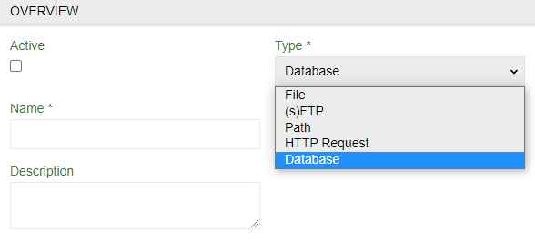
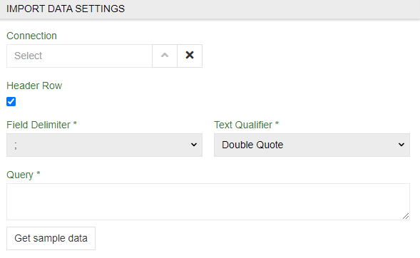

# Import Feeds: Database

When working with import feeds module you can import not only separate files but a whole database. To do so you will need `Import Feeds: Database` module.

>To do so you will stil need `Import Feeds` module.

## Importing database

To import database go to `Import Feeds` and select `Create Import Feed` option. There select `Database` type. Proseed threw other steps as usual untill `IMPORT DATA SETTINGS` tab.

## Import data settings tab

Here you have to first select `Connection` - select existing or create one.

`Header Row`, `Field Delimiter *` and `Text Qualifier *` are the same as in all import feeds. Proceed threw them as usual.

`Query *` is an SQL request to your database. Use it to select information you want to get.

### Connection menu

Here you can select established connections or create a new one. Use name, `Host` and `Port` to locate it and  `User` and `Password` (of your database) for the system to get access to it.

