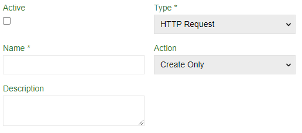
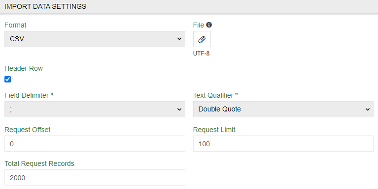
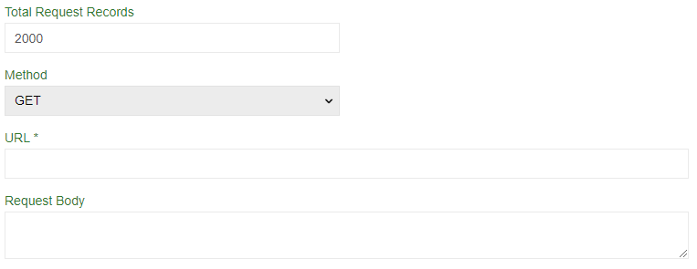

# Import Feeds: HTTP Request

When you don't want to download files every time and import them you may use `Import Feeds: HTTP Request` module. It will import data from place you provide using HTTP protocol and convert to acceptable for ATRO format

> Note that you will still need `Import Feeds` module to import anything.

## Creating HTTP Request feed

To create import feed using HTTP Request select `HTTP Request` as a `Type`. Then proceed as normal up to `IMPORT DATA SETTINGS` tab. 

### IMPORT DATA SETTINGS tab

Although you import by HTTP protocol you will still need an example file for configurator to figure HTTP Request out. Use it as your guiding hand and select any of the standard file type. Then proceed as normal up to `Request Offset` option.

- `Request Offset` – number of the first record that will be added. NOTE! First record is conted as 0
- `Request Limit` – amount of records that will be added in one import job
- `Total Request Records` - total value of imported records. If there are more then in `Request Limit` then multiple jobs will be done. In this example 20 jobs will be made to import all the values.

- `Method` – select request method
- `URL *` – select url where request will go
- `Request Body` - body of your request.

## Next steps

Proceed as normal. Use the data from example file to adjust configurator to your needs (this is all you need it for).
