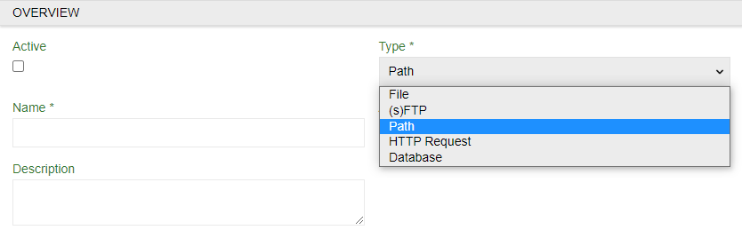
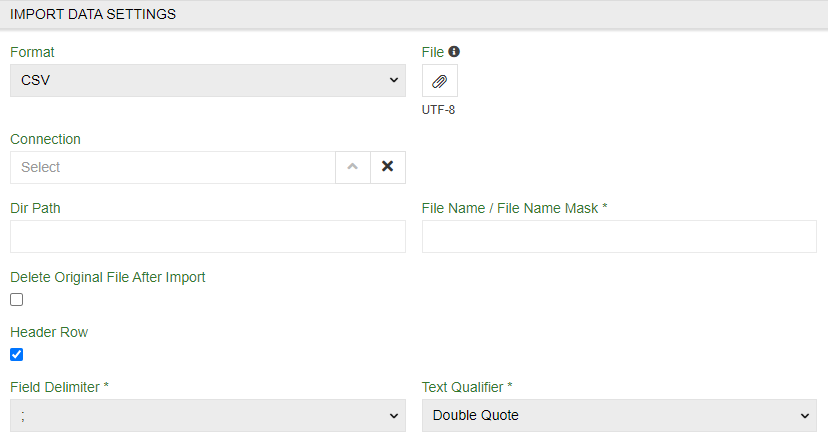
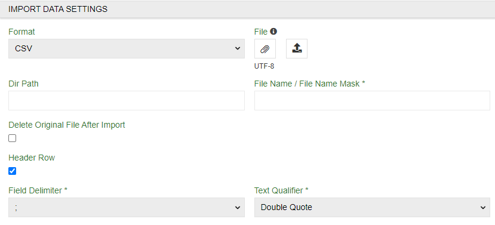

# Import Feeds: Remote File

When you have a certain please in the web where you have your files and don't want to download them every time and then import you may use `Import Feeds: Remote File` module. It will import all the files from place you provide.

> Note that you will still need `Import Feeds` module to import anything.

## Creating Remote File feed

To create import feed using Remote File select `(s)FTP` or `Path` as a `Type`. It will cahnge `IMPORT DATA SETTINGS` but for now proceed as normal up to it. 

## IMPORT DATA SETTINGS tab

### (s)FTP

Although you import by (s)FTP you will still need an example file for configurator to figure HTTP Request out. Use it as your guiding hand and select any of the standard file type.

- `Connection` – select existing or create one (creating a new one will be mentioned in a separate menu)
- `Dir Path` – path (link) to the file/files
- `File Name / File Name Mask *` – if you know exact name of the file write it down. If you know the logic of naming or have multiple files with similar names you can use mask (part of name/names) to find all corresponding files
- `Delete Original File After Import` checkbox - an option to clear all sucsessfully imported files from original place (to not use them again in future imports).

### Path

You can upload file by using `Dir Path` and `File Name / File Name Mask *` or attach file as usual for field settings in configurator.

- `Dir Path` – path (link) to the file/files
- `File Name / File Name Mask *` – if you know exact name of the file write it down. If you know the logic of naming or have multiple files with similar names you can use mask (part of name/names) to find all corresponding files
- `Delete Original File After Import` checkbox - an option to clear all successfully imported files from original place (to not use them again in future imports).

### Connection menu

Here you can select established connections or create a new one. Use name, `Host` and `Port` to locate it and  `User` and `Password` (of your database) for the system to get access to it.

