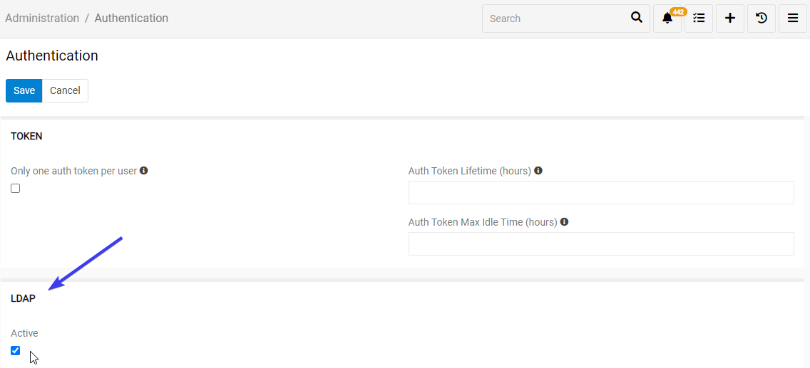
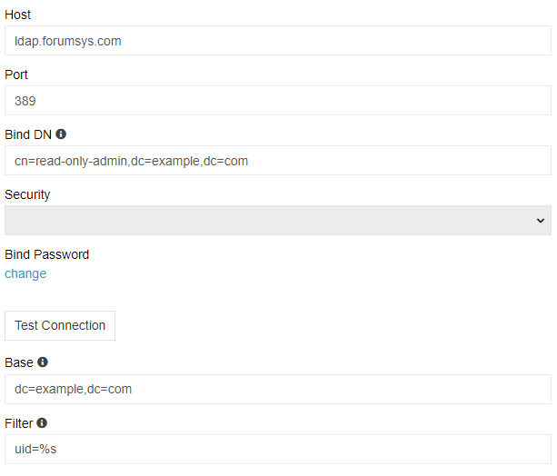
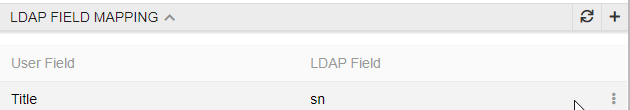
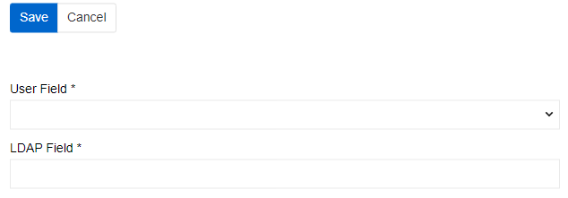
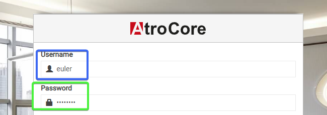
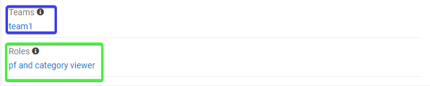
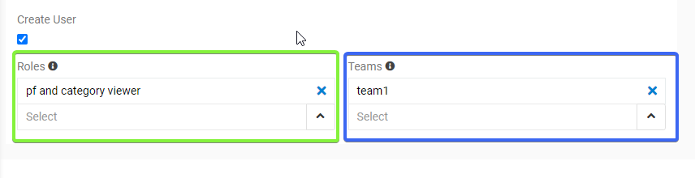

# Ldap authentication 

The LDAP module allows you to control AtroCore users via your own LDAP server. AtroCore always create user records, so If a new user is added via LDAP, a new record for this user will be created in AtroCore software autoamatically. For the new users a default role and a default team is assigned. Thease can still be changed via AtroCore Administration. 

Users can login via credentials, stored on the LDAP server or with their login and password.

## Administrator Functions

After the module is installed, a new LDAP panel is added in "Adminitration / Authentification". LDAP Authentification should be activated. After it you will be able to configure the connection to your LDAP Server. 

To connect to your ldap server you have to set it up in the settings menu. You can find all the information you need in your ldap server. The ldap server used for demo is ldap test server. The information thee is free and easy to use. To better see ir please visit https://www.forumsys.com/2022/05/10/online-ldap-test-server/.

- **Host** – LDAP IP or host name of your ldap server.
- **Port** – connection port of your ldap server. The port on which your directory server is listening.
- **Bind DN** - The distinguished name (DN) of the user that the application will use when connecting to the directory server. This recommended as an admin user with read-only mode, so it can search all your ldap users but not modify them.
- **Password** – the password of an admin user to get access to the LDAP server.
- **Security** – you can choose SSL or TSL protocol.
- **Base** - the default base DN which is used for searching users. On the demo it belongs to example.com.
- **Filter** - the filter which allows to restrict users who are able to use AtroCore.

Then you can test connection by clicking `Test Connection` button. If all is good, you will see `Connected` in the pop-up.

When user enters our system you can set his personal info to be automatically updated from ldap server. To do so use `Field Mapping` menu.

You can select any field from user profile to be updated. Just select a field in your system and a correspondent field of your ldap server.

> Please note, you will be able to select any field on ldap because they can be custom, but validation can fail. So, please, use it wisely.

## Logging in by a user

To log in the user should use the Username (in blue square) and Password (in green square) stored on the LDAP Server. 

After a User logs in for a first time a new user record for him is created in the AtroCore software (see "Administration / Users"). Default role (in green square) and Team (in blue square) are assigned to this user by default. Both can be changed by the AtroCore Administrator.

