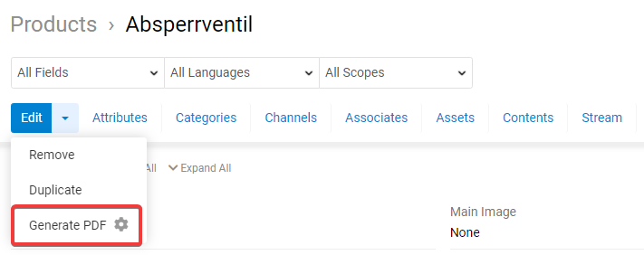
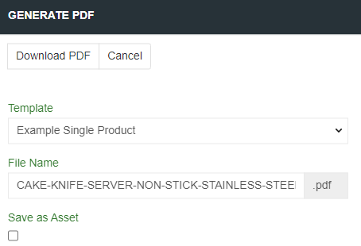
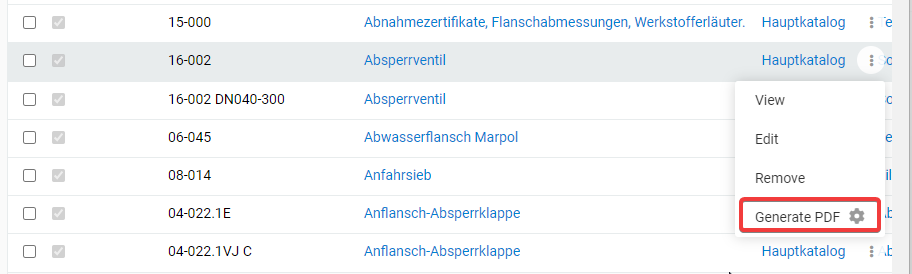
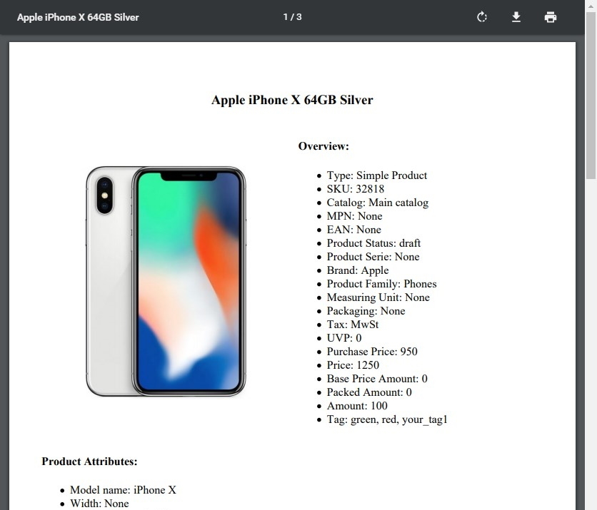
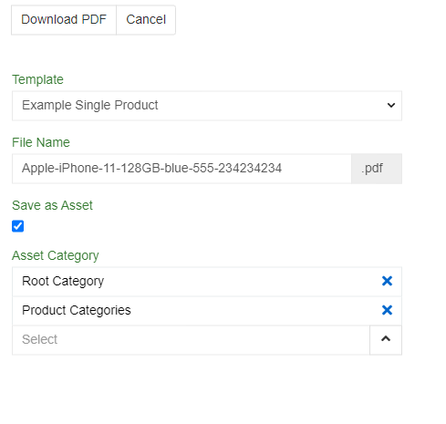
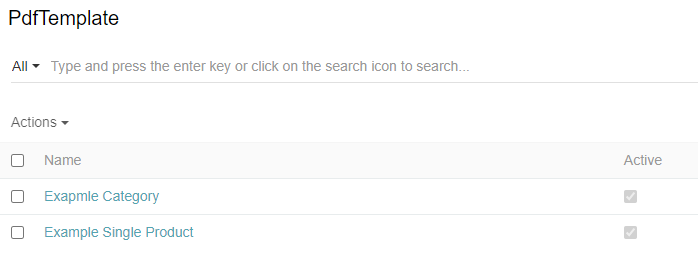
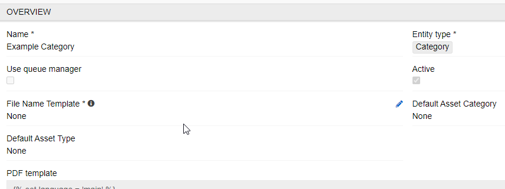
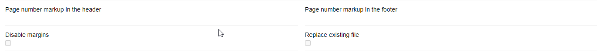

# PDF Generator

The "PDF Generator" module enables you to generate PDF files based on any data.

> Please note, templates for generation of PDF files are needed to be individually coded for this module to work. Usually these are coded directly by AtroCore Team or by our Solution Partner.

> Please note, for pdf generation chrome is required on your server. It is used for PDf generation.

PDF document can be generated for:
- single item, eg some product
- list of items, eg list of products.

> Please note, templates are created based on HTML/CSS. So anything is possible, what is possible with a modern HTML/CSS technology.

## Administrator Functions

"PDF Generator" module has no administrator settings.

## User Functions 

### PDF Creating for Single Item (e.g. Product)

If a template for creating of PDF for a single item is available following option appears in the actions menu on the detail page of the respective entity:

Click on "Generate PDF" to open the new window, where you have additional configuration options:

Here you can select the template (if you have more than one), which can be created for or by you. You can open the pdf document in a new tab or download it directly with the fine name you have defined previously.

It is also possible to create PDF directly from list page. Open the actions menu for the respective record and choose "generate PDF" for that.

Generated PDF looks exactly as defined in your template:

You can save pdf as an asset (to do it check the checkbox when generating pdf). PDf and asset default names are similar to products name plus SKU (after "-"). You can also select `Asset Category(s)` for your future asset.

 

> Please note, saving PDF as an asset fastens generating new PDFs for this product because new PDFs will be created from an asset.

### PDF Templates

PDF Templates are usually created by our team but if you want to do it yourself there is such an option. To get acsses to the templates go to `Administration/PdfTemplate`. Here you can see all templates created and edit/create one. PDF templates use TWIG template engine. Please check https://twig.symfony.com/ for syntax. CSS and HTML are also supported for editing PDF styles.

 

Select an `Entity type *` for a template. Each template has an input language configured in syntax. For different languages of the same entity you will need different templates.

If your template is too big so you are afraid of timeouts, use `Use queue manager` - now PDF will be created anyway (but it will be in queue manager).

 

`PDF template` field is your main body of a template. If you need additionally generated header and footer 
`Page number markup in the header` and `Page number markup in the footer` are there. They are configured same as `PDF template` field. So, if you need, for example, number of pages you can use pageNumber in the footer. If you want regular updates for a file, use `Replace existing file` checkbox - it will save al lot of server space.

Table of contents is not available by manual configuring but we can program it additionally.

 