# Pricing 

The "Pricing" module enables to operate with different prices for different customer groups and channels. In addition, you can take usage of scale pricing capabilities and automatic price recalculation for different currencies. The module enables you also to set the price in each currency for any amount of products manually.

You can create multiple price profiles to be able to set different prices. Examples of price profiles may be the following: Regular prices, Wholesale prices, B2B prices, VIP clients prices, Seasonal discounts, etc.

## Administrator Functions  

The "Pricing" module significantly extends the pricing functionality of the AtroPIM PIM System.

After the module installation, a new entity "Price Profile" is added to the system. It is also automatically added to your [Navigation Menu](../atropim/user-guide/user-interface.md#navigation-menu). New "Prices" panel is added to the [Products](../atropim/user-guide/products.md) detail view page.

### Currency Configuration

If you want to enable working with multiple currencies you need to configure these in the administration, go to `Administration > Currency`:

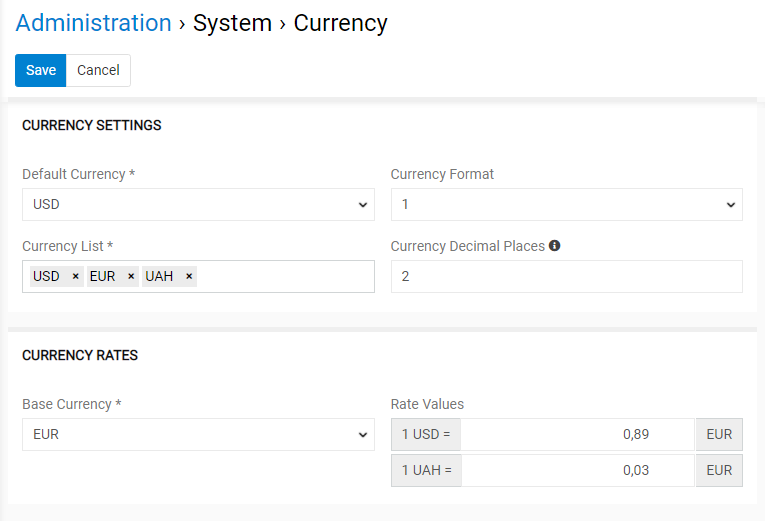

The `EUR` currency is set by default, but you can expand the list with as many currencies as needed. To do this, click the `Currency List` field and choose the desired options from the drop-down list that appears. 

Here you can also select the default currency (to be used when creating new records) and currency format via the corresponding drop-down lists. In the `Currency Decimal Places` field, specify the number of decimal places to be used in currency fields and calculations or leave the field empty to have all filled decimal places displayed.

On the "Currency Rates" panel you should also specify the conversion rates for the currencies available in the currency list if you want to use automatic price conversion. For this, select the base currency and enter its rate value according to other currencies.

Click the `Save` button to apply your currency configuration.

### Access Rights

By default, the pricing feature is enabled for all users, however, it can be disabled for certain user roles, if needed, on the `Administration > Roles > 'Role name'` page:

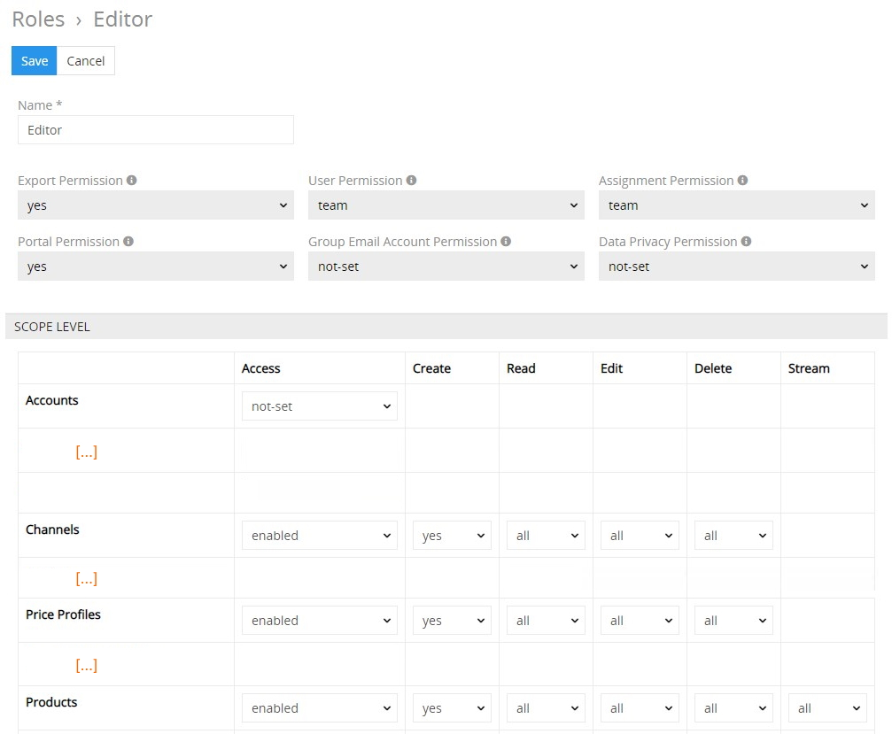

Please, note that access rights for `Channels` and `Products` should also be enabled.

## User Functions

After the "Pricing" module is installed and configured by the administrator, user can work with price profiles in accordance with his role rights that are predefined by the administrator.

## Price Profile

A price profile is a configurable price variation that allows you to define various prices for different groups of customers, both in numbers and currencies. 

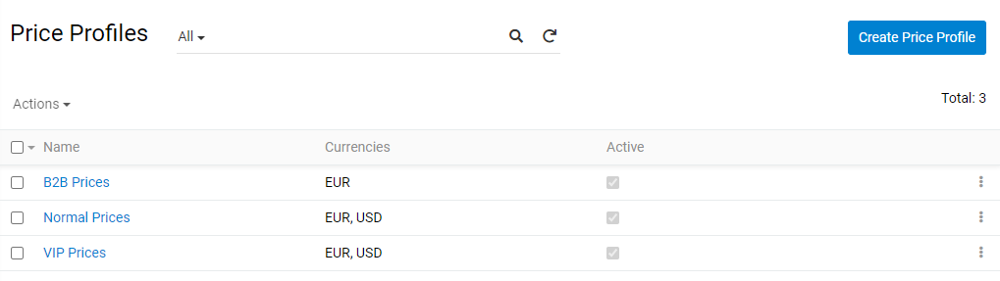

### Creating

To create a new price profile record, click `Price Profiles` in the navigation menu to get to the profiles [list view](../atropim/user-guide/views-and-panels.md#list-view), and then click the `Create Price Profile` button. The common creation window will open:

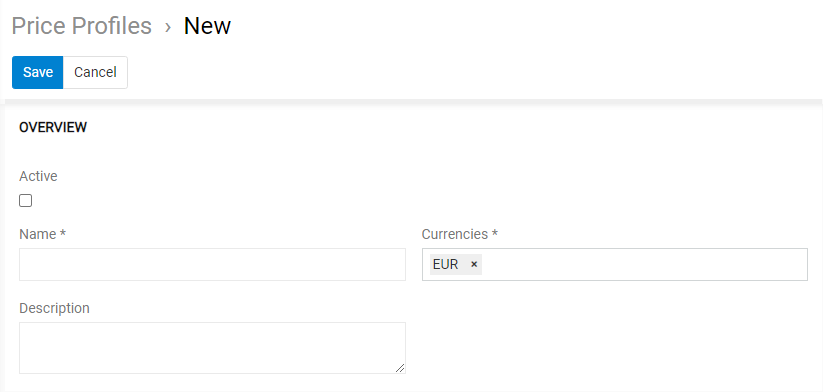

Here enter the desired name for the price profile record being created and define the currencies to be used in it (in accordance with the ones defined on the [currency configuration](#currency-configuration) step). 

Please, note that the default currency cannot be removed.

Activate the price profile and enter its description, if needed.

Please, note that only activated profiles are added to the products available in the system.

Click the `Save` button to finish the price profile creation and move to its [configuration](#configuring) or `Cancel` to abort the process.

### Assigning Price Profiles to Channels

After the new price profile is saven on the panel "Channels" you can select the channels, for which this price profile should be valid.

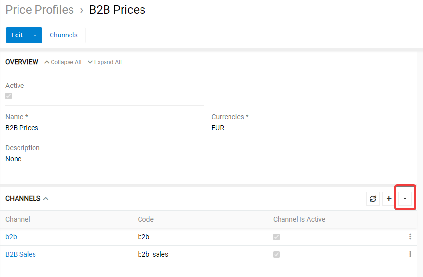

Alternatively, you can link price profiles with channels on the "Price Profiles" panel within the desired channel detail view page:

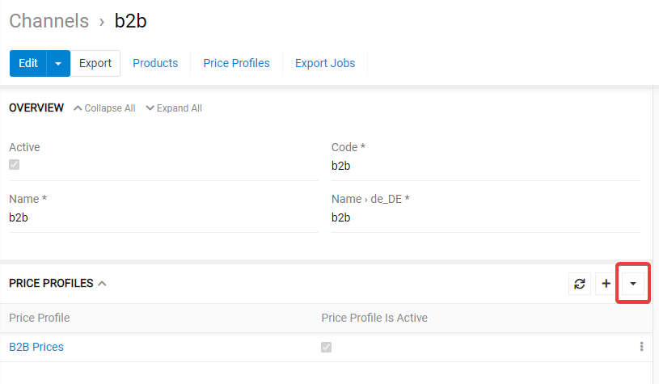

Thus, one Price Profile can be assigned to multiple Channels, and one Channel may have multiple Price Profiles assigned to it.

## Setting Product Prices

As soon as the active Price Profile is created, it is added to all products available in the system and is displayed on the "Prices" panel:

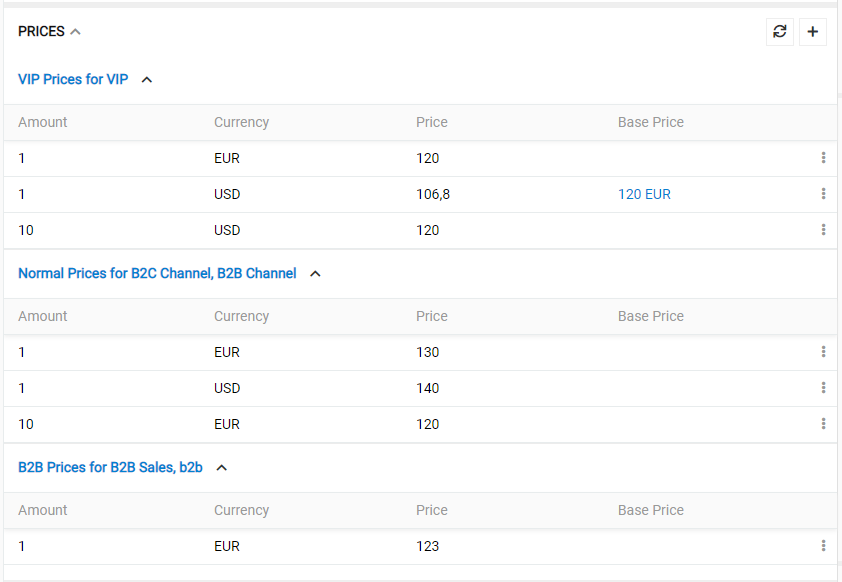

Here you can define product prices for all currencies pre-configured for the given price profile. To add a new price entry click on the plus icon in the top right corner of the panel.

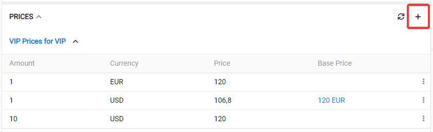

A popup window appears, in which you can set the desired minumum amount, select the respective price profile, currency and the price.

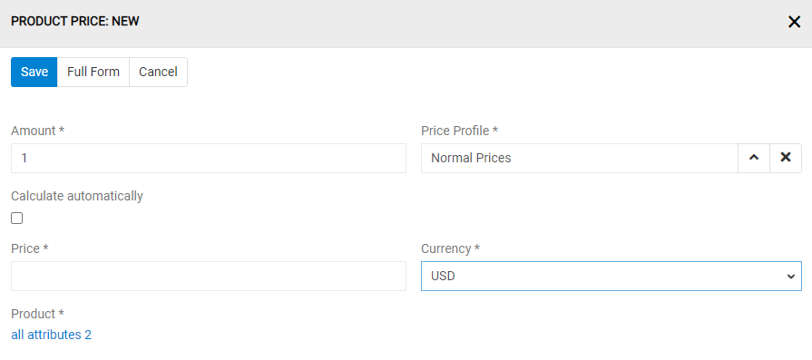

If a non-main currency is selected and a price entry for the current amount in the main currency exists, option "Calculate automatically" appears additionally. If set the price for the current currency will be calculated automatically. In the future if the price in the main currency for the current amount is changed the prices in this currency will be automatically recalculated. For such records "Base price" is set and is displayed on the "Prices" panel, so you can easily recognize, which prices will be recalculated automatically.

To edit some price enty select `Edit` from the record menu:

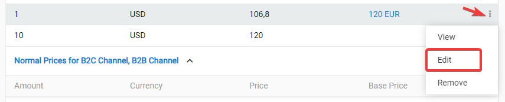

You can select `View` to see in the side popup all the information about a certain price entry.

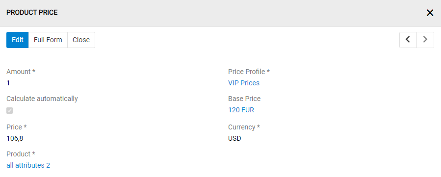

To remove a price entry, click on the option `Remove`.

## How Twig Fields Should be used for Price Calculation

When using the Twig type field, you have full flexibility in defining your calculation conditions or your calculation formula in the "Calculation Profile," as well as your minimum or maximum price validation on the "Price Profile" page.

On Price Profile page, pay attention to minimum and maximum price validation fields.

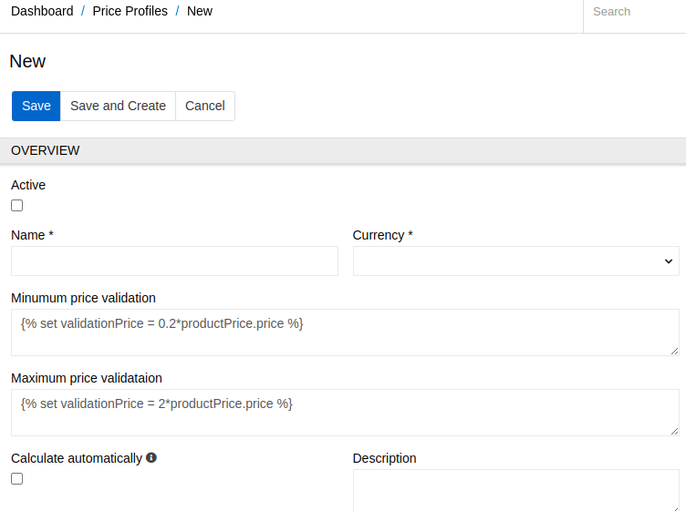

On Calculation Profile page, pay attention to calculation conditions and formulae fields.

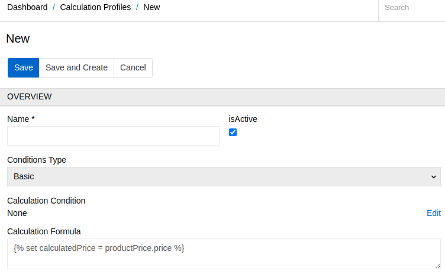

### For Calculation Conditions and Formulae in "calculation profile":
When you choose the Twig type field for a calculation condition or formula in the Calculation Profile, you'll see something like the following by default:




The proceed variable determines whether the condition is met, and the calculatedPrice variable determines the resulting price. You should not remove these variables, as doing so will distort the results. Instead, you can change their values as needed.
In calculation profile, you can use calculation parameter you have defined, it allows you to define global value which can be used in your calculation profile twig.

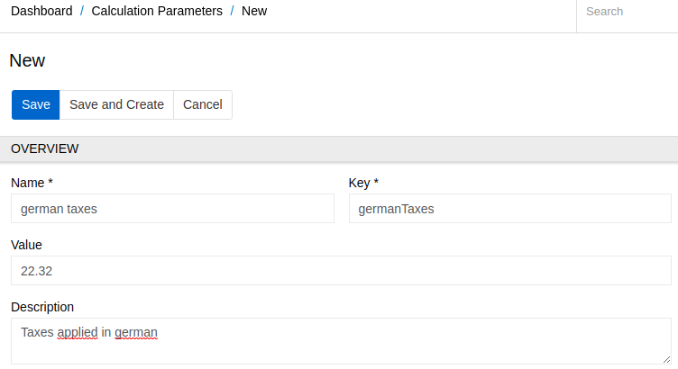

To use your calculation parameter in the twig fields, use it's key as the identifier : calculationParameter.key; for example, let's assume that i have added these three calculation parameters:
- name: "german taxes", key: "germanTaxes", value: 22.32
- name: "retail margin", key: "retailMargin", value: 7
- name: "shipping rates", key: "shippingRates", value: 20

to get one of value, i simply write calculationParameter.germanTaxes for german taxes; calculationParameter.retailMargin for retail margin, 
calculationParameter.shippingRates; 

#### Example Calculation Conditions
Here are some examples of how you can define your calculation conditions using Twig:

Example 1: Affecting a True or False Value


This condition will never be met, so the formula will never be applied.

Example 2: Dynamic Value


The proceed value will be dynamic; it will be true if the brand of the current product is one of those three, and false otherwise.

Example 3: With Calculation Parameter


    

    


In this example, we check if the product.tax is more or equal than our global calculation parameter german taxes identify by our key germanTaxes, and if the product quantity is less or equal than the minimum number for reseller identify by our key minimumForReseller then we set proceed to true

Example 4: Complex Condition


    

    

This example defines a condition based on tax and price. If the tax is between 10 and 25, proceed will be set to true. Otherwise, if the price is less than 50, proceed will be set to false.

#### Example Calculation Formulae
Here are some examples of how you can define your calculation formulae using Twig:

Example 1: Taking the Purchase Price as Base


This example sets the calculated price equal to the purchase price.

Example 2: Fixed Value


This example sets the calculated price to a fixed value of 150.

Example 3: With Calculation Parameter


    

    


In this example, we used our global calculation parameter to check condition and set calculatedPrice value

Example 4: Dynamic Calculated Price


    

    

    

In the first case, if the brand is empty, the formula will be 10 + product.tax * productPrice.price * 1.2. In the second case, if the tax is less than 30, we have another formula. In the last case, we round the value of 1.4 * price then subtract 2.

Example 5: Calculated Price from Another PriceProfile



In this example, you can define a price related to a price profile; you can use it throught the getPrice function, which needs 3 parameters: 
------------ the id of the product you target(in this case, it is the same product), the name 
------------ the name of the profile you target (in this case it is 'b2b usd profile'), you can copy and paste it in quotes
------------ the amount of product you target, with these elements, it is going to fetch the product price with all those 3 values
Then it will return a productPrice object, you can then use it to access any fields of element, in the example case, i just access the price field by using getProductPrice.price... then i multiply by 1.2 to have 20% more than the purchase price. At the end my calculatedPrice for the current product price is based on another product price  

Example 5: Smooth your price

In this example, you can define a smoothyPrice; smoothyPrice is price like 14.59$, 29.49$, 39.99$; the smoothyPrice has 4 parameters, the first one is the price to round; the second one is the delta value to redure or add; the third parameter is the multiplier roundTo, it can be 10, 1, 0.5 etc... the last parameter is the rounding direction to tell if we should round price up, down, or normal; default value is normal; See some examples to better understand

if we have smoothyPrice(12.65, -0.01, 1, 'up') = 12.99; first we round 12.65 according to multiplier 1 and direction 'up', we have 13, then 13 -0.01 = 12.99
if we have smoothyPrice(12.65, -0.01, 1, 'down') = 11.99; first we round 12.65 according to multiplier 1 and direction 'down', we have 12, then 12 -0.01 = 11.99
if we have smoothyPrice(12.65, -0.01, 1) = 12.99; first we round 12.65 according to multiplier 1 and direction 'normal', we have 13, then 13 -0.01 = 12.99
if we have smoothyPrice(12.65, -0.01, 0.5, 'up') = 12.99; first we round 12.65 according to multiplier 0.5 and direction 'up', we have 13, then 13 -0.01 = 12.99
if we have smoothyPrice(12.65, -0.01, 0.5, 'down') = 12.49; first we round 12.65 according to multiplier 0.5 and direction 'down', we have 12.5, then 12.5 -0.01 = 12.49
if we have smoothyPrice(12.65, -0.01, 0.5) = 12.49; first we round 12.65 according to multiplier 0.5 and direction 'normal', we have 12.5, then 12.5 -0.01 = 12.49
if we have smoothyPrice(12.65, -0.01, 10, 'up') = 12.49; first we round 12.65 according to multiplier 10 and direction 'up', we have 20, then 20 - 0.01 = 19.99
if we have smoothyPrice(12.65, -0.01, 10, 'down') = 12.49; first we round 12.65 according to multiplier 10 and direction 'down', we have 10, then 10 - 0.01 = 9.99
if we have smoothyPrice(12.65, -0.01, 10, 'normal') = 12.49; first we round 12.65 according to multiplier 10 and direction 'normal', we have 10, then 10 - 0.01 = 9.99
You can use this function at the last line to smooth your final price value;

### For "minimum validation price" or "maximum validation price"
When creating a new "price profile," you will see default validation values. By default, the minimum validation price is set to , and the maximum validation price is set to . These values ensure that the calculated price falls within a certain range based on the product price. For example, if the product price is 10, the minimum acceptable price will be 0.2*10 = 2, and the maximum acceptable price will be 2*10 = 20. If the calculated price falls outside of this range when the "recalculatePrice" function is executed, the calculated price will not be set, and the date at which the price validation failed will be recorded according to the minimum acceptable price.

You can also set a fixed value that is not dependent on the product price by setting . This means that the minimum/maximum acceptable price for any price will be 10. If a price less than 10 is set, it will fail, and the date will be registered in "Calculated price validation failure."

To access the fields of the product and product price, you can use the following syntax:

productPrice.price: Price amount in the entity Product Price
productPrice.calculatedPrice: Calculated price amount in the entity Product Price, which is to be recalculated
productPrice.amount: amount of the product
productPrice.priceCurrency: currency of the price
product.Price: Purchase price amount in the entity Product
product.brand: Brand of the product
product.tax: Tax of the product
With these elements, you can combine and define your minimum/maximum validation dynamically. Here are some examples:

#### Example for minimum and maximum price validation
Example 1 (taking the purchase price as a base):


Example 2 (setting a fixed value for price validation):


Example 3 (dynamic price validation with condition):








