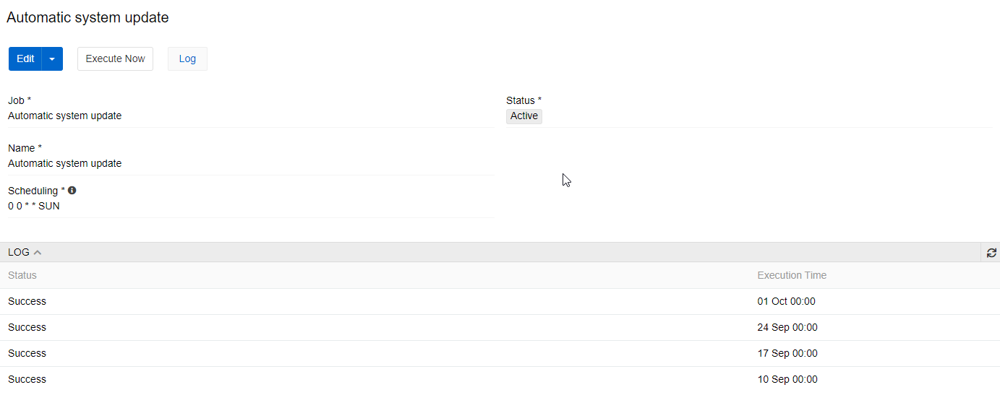
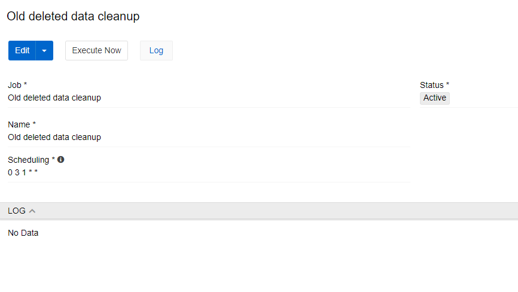
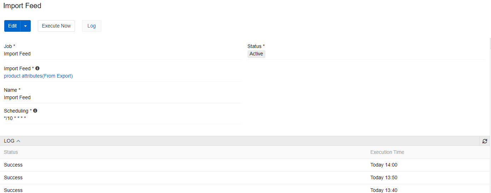
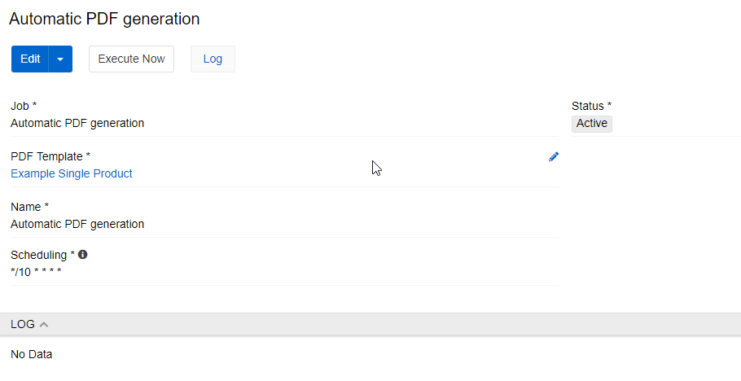
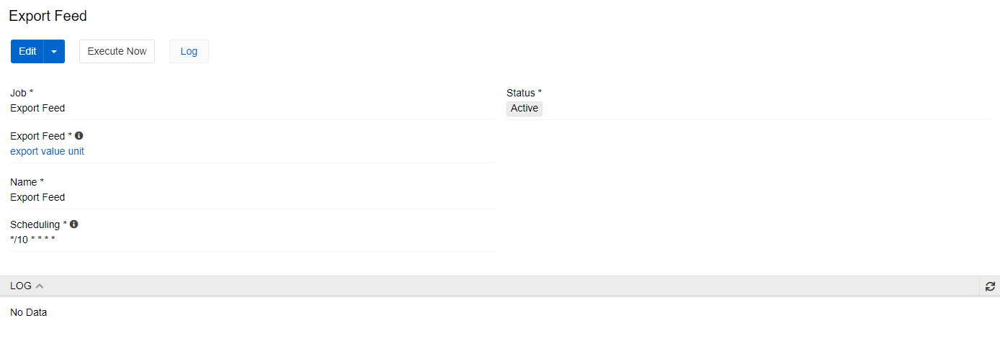
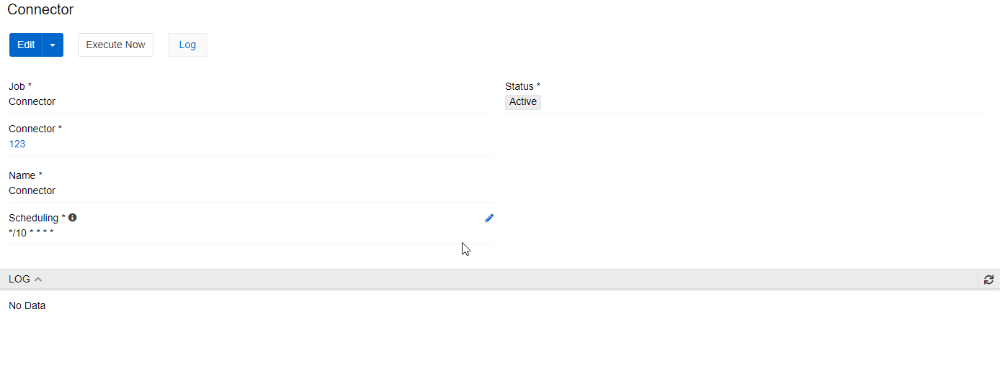
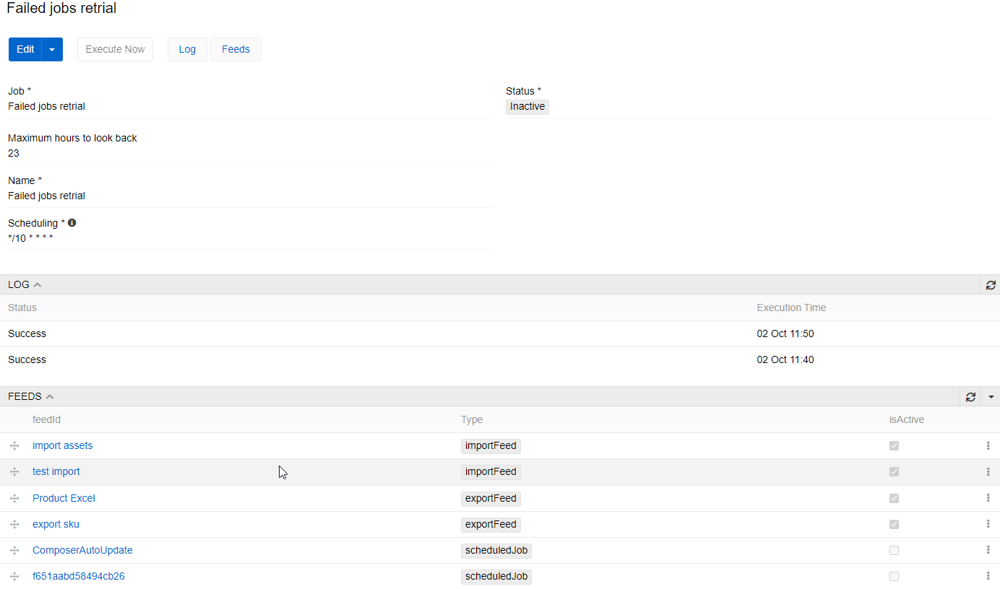

# Scheduled Jobs

Scheduled Jobs allow you to orchestrate multiple actions, such as import and export feeds, job retrials, system updates, etc to be executed automatically. You can set the sort order for the execution of your Retrial, run the sequence at the given time, or manually, in just one click.

## Main functions

Every job has a type `Job` (type of the Scheduled Jobs), `Name`, `Status` and `Scheduling`. `Scheduling` defines frequency of job runs. To use it, press `i` to get the syntax. For example, 0 0 * * SUN on the picture below runs the job on every Sunday. Default `Name` (if not set manually) is the same as `Job` and `Scheduling` is "*/10 * * * *".

You can also run the job right now, not regarding the schedule. You can do it by pressing `Execute Now` button.

> Note that no two executions can be run in the same minute. The time used in it is system time.

All job executions can be seen in log.

## Scheduled Jobs types

Scheduled Jobs can provide different job types to execute:

### Automatic system update

This jobs start system update on the schedule you set. The settings set by update are taken from the `Modules` menu, so it is essentially pressing the `Update` button on the set time.

### Old deleted data cleanup

This job cleans old data that was deleted but is stored in system in case you need backups.

### Import Feed

This job starts the selected import feed on the schedule you set. The settings set by the feed are taken from the feed menu, so it is essentially pressing the `Import` button on the set time.

### Automatic PDF generation

This job starts generating PDFs as assets that are appropriate for selected PDF template.

> Note that this job may take a lot of time and server resources, so please schedule its execution when you do not need to work in the system.

### Refresh Cache for Dynamic Relations

This job is used when you use dynamic relations, such as dynamic categories. Refreshing cache is needed for relations to show up-to-date data.

### Export Feed 

This job starts the selected export feed on the schedule you set. The settings set by the feed are taken from the feed menu, so it is essentially pressing the `Export` button on the set time.

### Recalculate Product Price

This job is used when you use dynamically calculated prices. This job starts recalculating action for all products. 

> Note that this job may take a lot of time and server resources, so please schedule its execution when you do not need to work in the system.

### Update exchange rates via ECB

This job inserts current exchange rates taken from ECB to PIM currencies. Only currencies and rates supported by ECB are affected by this job.

### Connector

This job starts the selected connector on the schedule you set. The settings set by the feed are taken from the connector menu, so it is essentially pressing the `Execute` button on the set time.

### Failed jobs retrial

This job looks for the selected jobs done by import and export feeds and/or other scheduled jobs and then starts ones of them that had failed status in the last hours set in `Maximum hours to look back` field.

