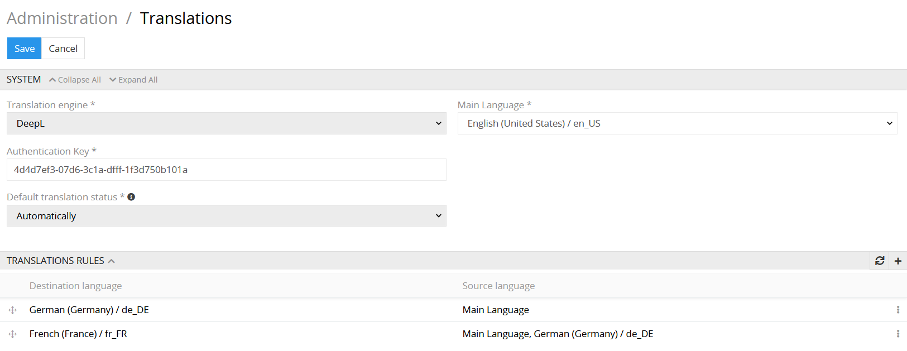
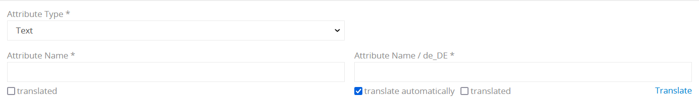
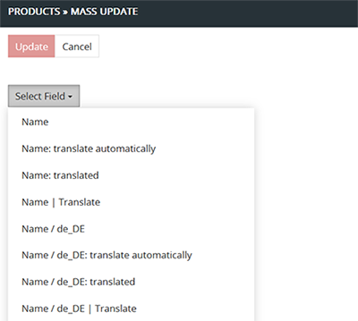

# Translation

The "Translation" module is designed to provide automated translations to multilingual fields. and thus increase the data quality allows the user to create product families with hierarchical interconnection. Product family is a group of products with common features defined as attributes. The advanced classification function facilitates product family creation and management as well as product filtering. The module enables you to manage product families that are similar but slightly differ from each other. 

## Translation module setup

You can configure your "Translation" module by going to Administration panel > Translations.

 

- **Translation engine** – select the machine translation engine to provide the automated translations to your multilingual fields.
- **Main Language** – set the main language for your interface.
- **Authentication Key** – this is a required value to get access to the DeepL translation engine API. To obtain it you need to register on the DeepL website.
- **Default translation status** – here you can set the translations to be performed automatically or manually by default. If you choose the "automatically" default status all new field or attribute values will be set up for automatic translation.

### Translation rules configuration

On the `Translation rules` panel all your translation configurations are reflected. To create a new translation rule click the `+` button on your panel.

  
 
In the new window you will be able to set up your translation rule. Only after you configure and add the rule for particular language it will be available for automated translation.

  

- **Destination language** – the language to which the translation is made.
- **Source language** – the language which is the basis for translation. If the source language value is empty, the translation is not possible.

### Language configuration

In order to add a new language go to Administration panel > Languages. In the dropdown menu choose as many languages as you need.

 
 
## Multilingual fields configuration

After the "Translation" module proper installation the following configurations to your product fields will be available:

 

Select `translate automatically` option if you want your multilingual fields to be translated instantly. After you enter the value of the source language its translations will be set automatically into the corresponding text boxes for every destination language specified in the translation rules.

The `translated` checkbox carries out an information function and is used to mark the fields that have been translated either automatically or manually.

The `Translate` button under the right end of the text box is used to provide a machine translation for the fields with `translate automatically` option switched off.

You may change the `translate automatically` and `translated` values of the field/attribute in the edit mode. To switch to the edit mode click the pencil icon.

  

*For some languages the automated translation option may not be available. In order to enable it, you need to configure the **Translation rules** for this language.*

## Mass action

In order to apply an action to multiple entities simultaneously, choose the required entities by clicking the left checkbox on the list page click the `Actions` dropdown menu and choose `Mass update` option.

   

In the opened window click the `Select field` dropdown menu. For each multilingual field three actions are available.

    

- **translate automatically** – the machine translated will be provided as soon as the source language value is set.
- **translated** – this checkbox will be marked as true if the value has been set by an automatic translation. If you provided a manual translation, you can set it to true by yourself. However, you may want to set it to false if you are not satisfied with the quality of the machine translation and want to modify it later. 
- **Translate** – if the value has not been translated automatically, you may still provide it with the machine translation by clicking the `Translate` button. Please take into consideration that this button will not be available if the translation rule for this language is not provided.

## Import & Export Feeds

With "Translation" module the extended functionality will be provided for the Export and Import Feeds modules as well. In the configurator settings you will be able to specify the additional values of the multilingual fields. 

 

- **"Field name": translate automatically** – choose this option to export/import the "translate automatically" value of the corresponding field.
- **"Field name": translated** – choose this option to export/import the value indicating whether this field has been translated. 
- **"Field name" | Translate** – this option is identical to the action of the `Translate` button. It provides the machine translation for the specified field.