# Translations

The "Translations" module is designed to create automated translations and enforce manual translations for multilingual fields, and, thus, increase the overall data quality. The module can use DeepL and Google Translate as the machine translation engine.

## Administrator functions

### Translation module setup

You can configure your "Translations" module by going to "Administration panel / Translations".

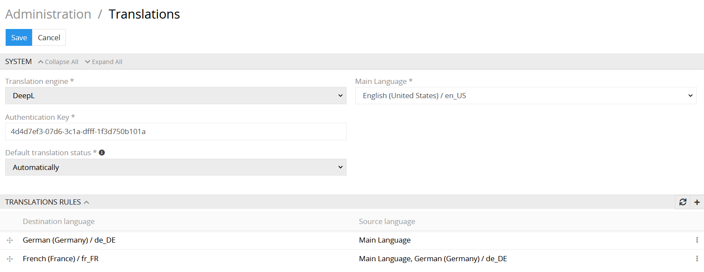 

- **Translation engine** – select the machine translation engine to provide the automated translations to your multilingual fields.
- **Main Language** – set the main language: choose the language which you consider as a main language in your system.
- **Authentication Key** – this is a required value to get access to the DeepL translation engine API. To obtain it you need to register on the DeepL website.
- **Default translation status** – here you can set the default translation status which is automatically applied to all multilingual fields (e.g., for a newly created product) and attribute values (e.g. newly added to a product).

### Default translation status

Default translation status is a mark for the system, whether the value should be translated and saved automatically or not.

Possible values are:
- manually: means that the system will never translate the field or attribute value automatically
- automatically: means that the system will translate the field or attribute value automatically directly after the value in original language is changed.

If the language you want to translate to does not exist in translation rules when translating module will just copy information from a source box without translating it.

### "Approved" option configuration

In the module settings you may enable an additional parameter for your multilingual text fields, namely the "approved" option. Here you can also determine what action should be taken on the "approved" checkbox when a field is automatically translated. Possible values are:
- set "approved" checkbox: checkbox is checked after the record has been translated automatically
- unset "approved" checkbox: the checkbox is cleared after the record has been translated automatically
- do nothing: the value of the checkbox does not change after automatic translation

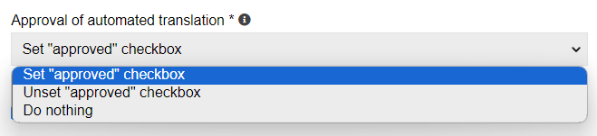 

You can use this value from "true" to "false" if you are not happy with the quality of machine translation and want to edit it later. After the edition you may set the "translated" value to "true" manually to mark it as correctly translated.

Please note that any information concerning the "approved" parameter hereafter is effective only in case it is enabled in settings.

### Translation rules configuration

On the `Translation rules` panel all your translation configurations are reflected. To create a new translation rule, click the `+` button on your panel. For source and destination languages only, the languages supported by the chosen translation engine can be selected.

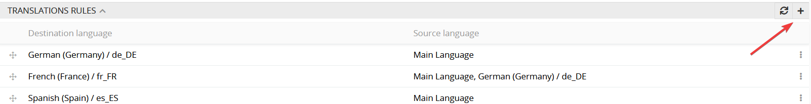  
 
In the side-popup window you will be able to set up your translation rule. Only after you configure, add the rule for a particular destination language and set it as "Active" it will be available for translation. To be able to translate records  using a rule automatically, you need to set the checkbox "Enable automatic translation" for this rule. 

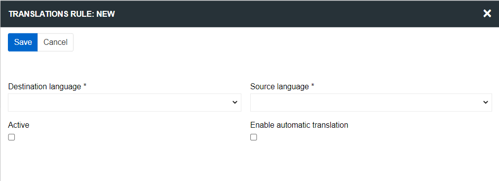  

- **Destination language** – the language to which the translation is made.
- **Source language** – the language which is the source for the translation.
- **Active** - the status of the translation rule.
- **Enable automatic translation** - allow to use this rule for automatic translation.

Please note, if there is no translation rule for some language as a destination language or if the rule is inactive, the translations to that language will not be made, either automatically or by clicking the `Translate` button.

For each destination language only one source languages can be selected. If you want to have multiple source languages for the same destination language, you can create multiple rules for it. By changing the sorting order of the rules, you define the order, in which source language the value is looked up. E.g., if for the Spanish as a destination language there are two translation rules with English and German source languages  – the system will look up for the value in English, if it is available (active/enable for automatic translation) it will be taken, if not the system will take the value for the second language, namely German, and so in.

### Language configuration

System always has a Main Language, which can be any language of your consideration. All the additional languages should be configured additionally. Translations can only be made only for available pre-configured languages.

To add a new language, go to "Administration panel / Languages". In the dropdown menu choose as many languages as you need.

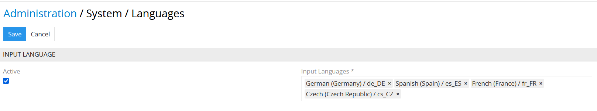 

## User functions

### View mode

Depending on the preconfigured parameters your multilingual text field may be marked with the following icons:

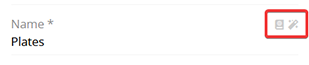 

The "Book" icon indicates that this field is not marked as "translated", and the "Magic wand" icon indicates the automatically translated fields.
To switch to the edit mode, hover the mouse over the field you want to edit and click the pencil icon. 

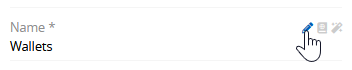  

### Edit mode

After the "Translations" module is properly installed and translation rules are configured additional meta data appears for each multilingual field:

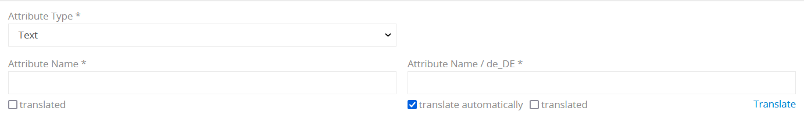 

The following options appear for multilingual fields and attributes:

- **approved** – this checkbox is used to mark the field/attribute value as translated, available for all multilingual fields and attributes.
- **not translate from** - if checked, translation is triggered for no language. The value of the checkbox is not saved, it is advisable to use it only when editing a record in edit mode, if you do not want the change of this field (attribute) to affect fields (attribute) in other languages. This checkbox appears only if there is at least one translation rule from this language and checkboxes "Active" and "Enable automatic translation" are set for it. 
- **not translate to** - if this checkbox is set, automatic translation of this field (attribute) does not occur when editing fields (attributes) in other languages. The value of the checkbox is not stored, it is possible to use it only when editing a record in edit mode. This checkbox appears only if there is at least one translation rule to this language, checkboxes "Active" and "Enable automatic translation" are set for it and checkbox "translate automatically" is set for the field (attribute). 
- **Translate** – if the value has not been translated automatically, you may still provide it with the machine translation by clicking the `Translate` button. Please take into consideration that this button will not be available if the translation rule for this language is not created.

If you want your multilingual value to be translated automatically you should set `translate automatically` checkbox in field (attribute) configuration. 

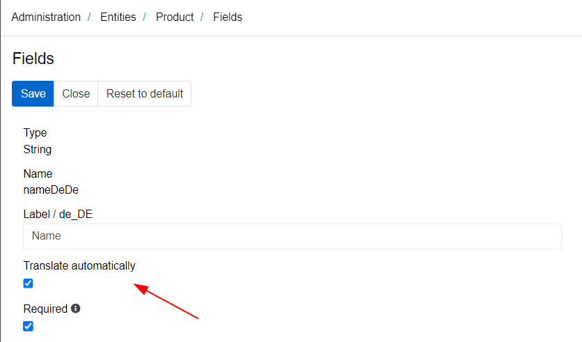 

Translation is executed for all values marked as `translate automatically` in all languages specified in translation rules as destination languages for which the language of the edited value is set as one of the source languages if the rule is active and automatic translation is enabled for it. In this case translations will be executed automatically for all corresponding fields/attribute values for every destination language specified in the translation rule. 

The `approved` checkbox carries out an information function and can be used to mark the value that has been translated either automatically or manually. For each multilingual field/attribute the module adds additional meta data and action fields, which can be used anywhere in the system:
- **"Field name" / Approved** – metadata field: possible values are "True" or "False". These field can be used for mass actions, import/export feeds and search and filtering.

The `Translate` button on the right corner under the text box is used to apply a machine translation for a certain value, regardless of whether both checkboxes are set or not.

In the edit mode all the changes/translations can be still changed, and you may change also the `not translate from`, `not translate to` and `translated` checkboxes anyway you like.

### In-line edit mode

Changing some values via in-line edit mode may trigger automatic translations, if for the corresponding values the checkbox `translate automatically` is set. Thus, the new translated values for the corresponding fields are automatically stored in the database, without possibility to review these changes. So, if you always need to review the changes before saving a data record, please always use the edit mode. 

Please note, if you change the "translate automatically" value to "true" the automated translation will be triggered only after the editing the source language value.

### Mass action

#### Updating field values

To apply an action to multiple entities simultaneously, choose the required entities by clicking the left checkbox on the list page, click the `Actions` dropdown menu and choose `Mass update` option.

   

In the opened window click the `Select field` dropdown menu. For each multilingual field two actions are available.

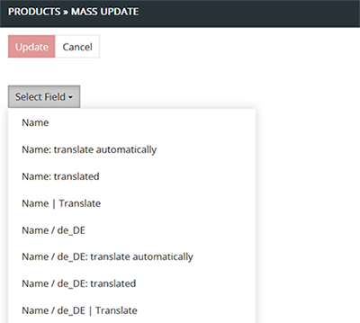  

Possible additional choices are:
- **"Field name" / Approved** – choose this field and set/unset the checkbox to change the meta data value `approved` for the field "Field name" for the selected data records.
- **Translate** – usage of this field triggers a click on the `Translate` button for the field "Field name" for the selected data records.

#### Updating attribute values

The same mass translation actions as for fields can be performed for multilingual attributes. To do this, you need to click the "Select attribute" button in the "Mass update" window and select the desired attribute. In the appeared window you can choose the scope and language of the attribute you want to change by mass action and click on "Add" button.

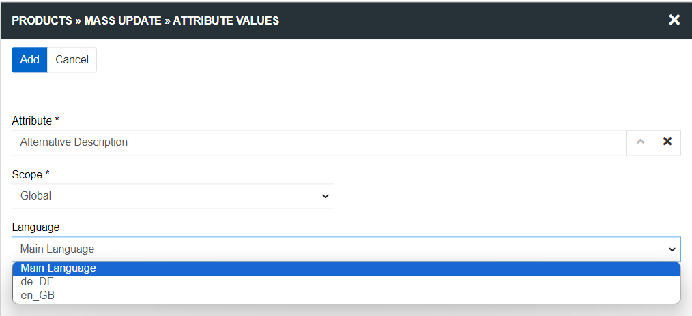  

In the next window, a field for entering the attribute value and a "Translate" checkbox will appear on the bottom right. Usage of this checkbox triggers a click on the `Translate` button for the choosing attribute for the selected data records. If you check this box, the field for entering the attribute will become inactive. If any value is already set in it, it will be deleted.

You can also perform a mass translation of all possible fields and attributes to a specific language for selected records. To do this, select the required records of the entity, click the "Actions" button and select an option `Translate / language`. After that, all records in the selected language will be translated according to the first active rule, for which this language is selected as "Destination language" and the checkbox "Enable automatic translation" is set.

You can also perform a global translation of all records in the system according to the selected rule. To do this, go to the module settings, select the required rule in the translation rules panel, click on the three dots to the right of it and select the "Apply globally" option.

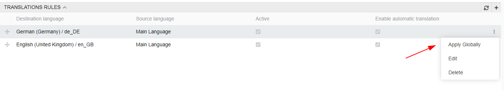  

### Translation Glossaries

In deepL you can create your own glossary to specify translations for some words and to avoid undesired translations (for example, for brands). You can create any number of glossaries with an unlimited number of terms. To create Translation Glossary go to the `Administration / Translation Glossaries` and click Create Translation Glossary button.

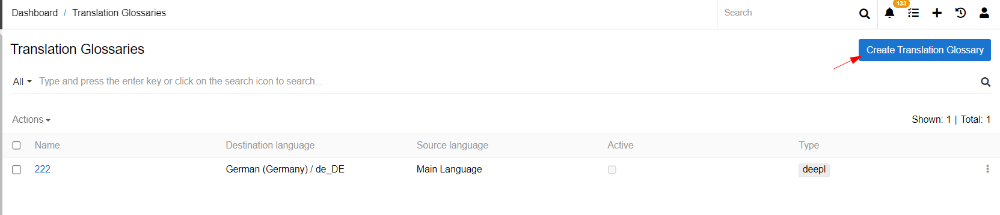  
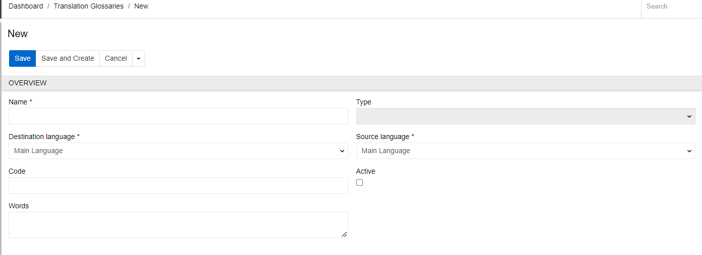  

- **Name** – specify the name of your glossary
- **Type** – set the glossary type. Possible values of the field: empty and deepL. Only if the "deepL" type is selected, the glossary will be used for automatic translation
- **Destination language** – the language to which the translation is made
- **Source language** – the language which is the source for the translation
- **Code** – specify the code of your glossary
- **Active** – the status of the translation rule. If the glossary is inactive it can not be added to the translation rule
- **Words** –  a text field in which pairs of words are written. Terms in glossary should be written as pairs separated by a colon (source word : destination word). Each pair should be written on a separate line.

Please note that in order for the glossary to be used during translation, you need to activate it, select the deedL type and add it to the translation rule.

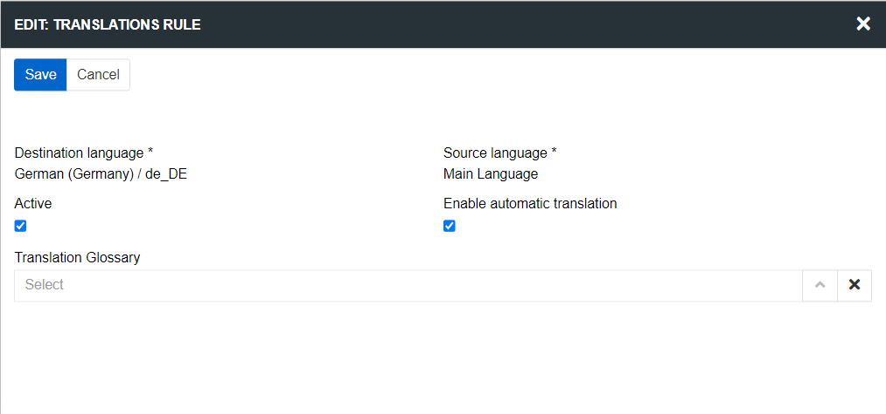  

For a translation rule, you can select only the glossary whose source and destination languages match the source and destination languages of the rule. Only one glossary can be selected for one rule. If the selected glossary is of the DeepL type, it is used to receive the translation.