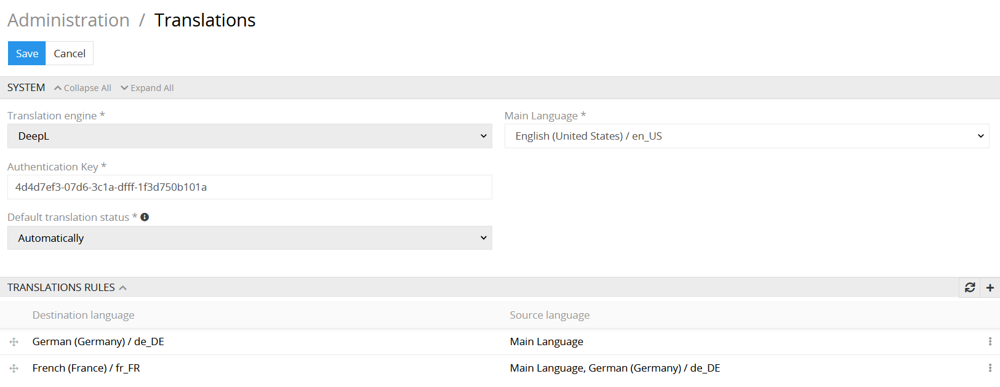
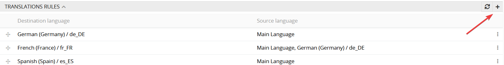
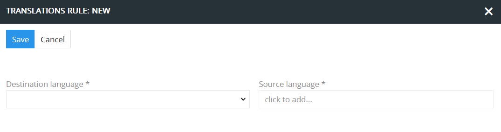
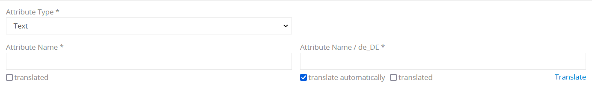
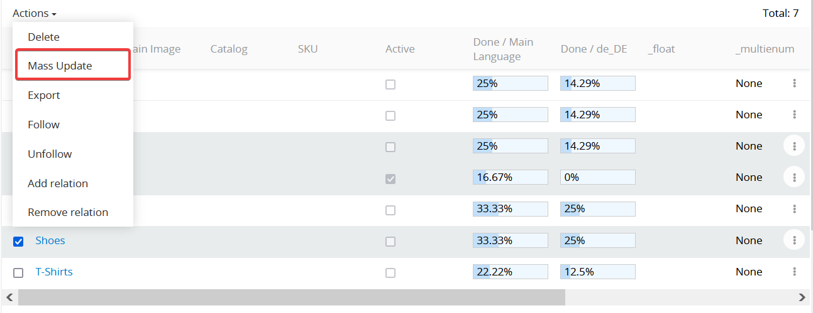
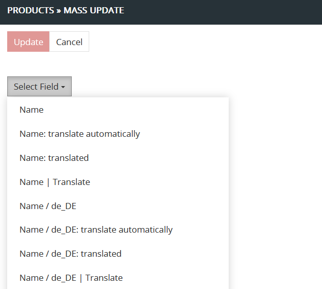
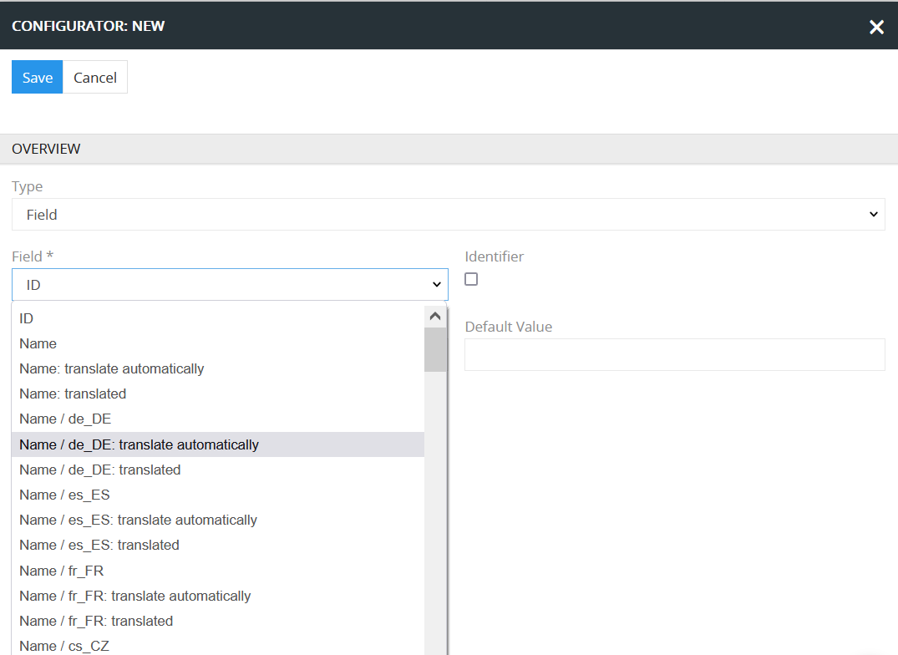

# Translations

The "Translations" module is designed to create automated translations and enforce manual translations for multilingual fields, and, thus, increase the overall data quality. 

## Administrator functions

### Translation module setup

You can configure your "Translations" module by going to Administration panel > Translations.

 

- **Translation engine** – select the machine translation engine to provide the automated translations to your multilingual fields.
- **Main Language** – set the main language: choose the language which you consider as a main language in your system.
- **Authentication Key** – this is a required value to get access to the DeepL translation engine API. To obtain it you need to register on the DeepL website.
- **Default translation status** – here you can set the default translation status which is automatically applied to all multilingual fields (e.g. for a newly created product) and attribute values (eg newly added to a product).

### Default translation status

Default translation status is a mark for the system, whether the value should be translated and saved automatically.

Possible values are:
- manually: means that the system will never translate the field or attribute value automatically
- automatically: means that the system will translate the field or attribute value automatically as soon as this value will be marked as to be translated.

### Translation rules configuration

On the `Translation rules` panel all your translation configurations are reflected. To create a new translation rule click the `+` button on your panel.

  
 
In the new window you will be able to set up your translation rule. Only after you configure and add the rule for a particular language it will be available for automated translation.

  

- **Destination language** – the language to which the translation is made.
- **Source language** – the language which is the source for the translation.

Please note, if there is no translation rule for some language as a destination language, the translations to that language will no be made, whether automatically nor by clicking on the `Translate` button.

Created rules cannot be modified. For some destination language only one rule can be created. So, if you want to modify a rule for some destination language you need to remove it and create a new translation rule.

### Language configuration

Our system always has a Main Language, which can be any language of your consideration. All the additional languages should be configured additionally. Translations only to configured languages can be made.

To add a new language, go to Administration panel > Languages. In the dropdown menu choose as many languages as you need.

 

## User functions

### View mode

???????????????????????????????????? тут це треба описати, також про інформативні іконки і додати скріншот
To switch to the edit mode click the pencil icon. - цей скріншот не вдалий він не показує обидві можливі іконки, треба замінити

  

### Edit mode

After the "Translations" module is properly installed and configured additional meta data appears for each multilingual field:

 

You have two checkboxes – `translated` and `translate automatically` as well as an additional button `Translate`.

- **translate automatically** – translation for the field/attribute value above will be made automatically as soon as the source language value is set.
- **translated** – this checkbox is used to mark the field/attribute value as translated.
- **Translate** – if the value has not been translated automatically, you may still provide it with the machine translation by clicking the `Translate` button. Please take into consideration that this button will not be available if the translation rule for this language is not provided.

Please note, the checkbox `translated` will be automatically set if the checkbox `translate automatically` for the value is set and translation is executed. 
You still can unset this checkbox, if you are not satisfied with the quality of the translation, or set it manually, if translation is done manually. In no other case this checkbox is set or unset by the system automatically.

Set `translate automatically` checkbox if you want your multilingual value to be translated into automatically. Translation is executed for all values marked as `translate automatically` and not marked as `translated` in all languages specified in translation rules as destination languages for which the language of the edited value is set as one of the source languages. In other words translations will be executed automatically for all corresponding fields/attribute values for every destination language specified in the translation rule. 

The `translated` checkbox carries out an information function and can be used to mark the value that have been translated either automatically or manually.

The `Translate` button on the right corner under the text box is used to apply a machine translation for a certain value, regardless of whether both checkboxes are set or not.

In the edit mode all the changes/translations can be still changed, and you may change also the `translate automatically` and `translated` checkboxes anyway you like.

Please note, the option `Translate automatically` is available only for the languages, for which a translation rule is created. And a translation rule can be created only if the destination language is supported. E.g. Ukrainian is not available for translations via DeepL, so no translation rule can be created for it.
For some languages the automated translation option may not be available. In order to enable it, you need to configure the **Translation rules** for this language.

### In-line edit mode

Changing some value via in-line edit mode may trigger automatic translations, if for the corresponding values the checkbox `translate automatically` is set and the checkbox `translated` is not set. Thus, the new translated values for the corresponding fields are automatically stored into the database, without possibility to review these changes. So, if you always need to review the changes before saving a data record, please always use the edit mode. 

## Additional possibilities

For each multilingual field/attribute the module adds additional meta data and action fields, which can be used anywhere in the system.
- **"Field name": translate automatically** – meta data field: possible values are "True" or "False".
- **"Field name": translated** – metadate field: possible values are "True" or "False".
- **"Field name" | Translate** – action field: usage of this field will trigger a click on the button `Translate`.

These fields can be used for mass actions, import/export feeds and search and filtering.

### Mass action

To apply an action to multiple entities simultaneously, choose the required entities by clicking the left checkbox on the list page click the `Actions` dropdown menu and choose `Mass update` option.

   

In the opened window click the `Select field` dropdown menu. For each multilingual field three actions are available.

<!-- скріншот завеликий, треба замінити -->

  

Possible additional choices are:
- **"Field name": translate automatically** – choose this field and set/unset the checkbox to change the meta data value `translate automatically` for the field "Field name" for the selected data records.
- **"Field name": translated** – choose this field and set/unset the checkbox to change the meta data value `translated` for the field "Field name" for the selected data records.
- **"Field name" | Translate** – usage of this field triggers a click on the `Translate` button for the field "Field name" for the selected data records.

### Usage of Import & Export Feeds

Additional meta data for multilingual fields or attributes can also be used for import and export.

With "Translations" module the extended functionality will be provided for the export/import feeds as well. In the configurator settings you will be able to use these "additional fields". 

<!-- скріншот завеликий, треба замінити -->

 

Possible additional choices are:

- **"Field name": translate automatically** – choose this option to export/import the "translate automatically" value of the corresponding field.
- **"Field name": translated** – choose this option to export/import the value indicating whether this field has been translated. 
- **"Field name" | Translate** – this option is available only for the import feeds is identical to the click on the `Translate` button. It applies a machine translation for the specified field value. It can only be used in import feeds.

just testing edition, please remove this :)
