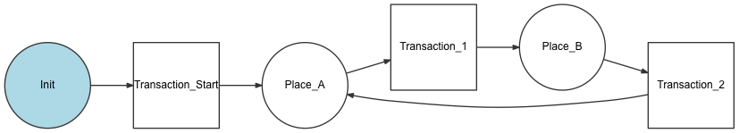
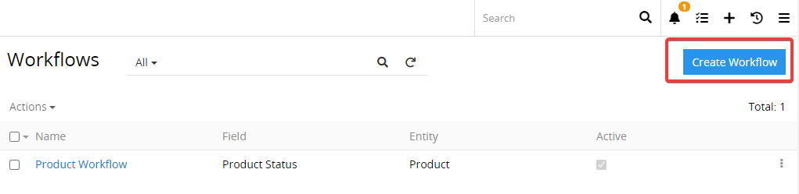
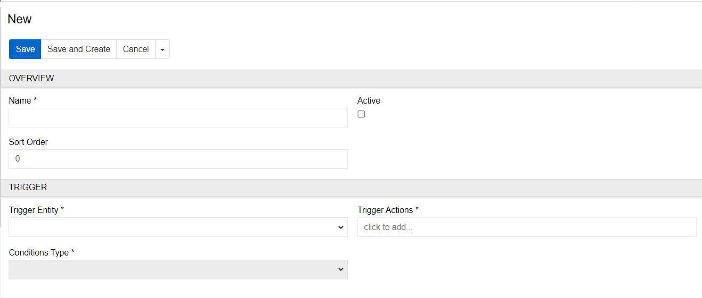
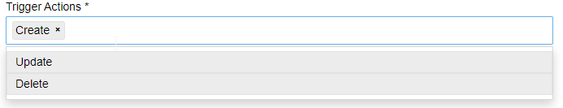
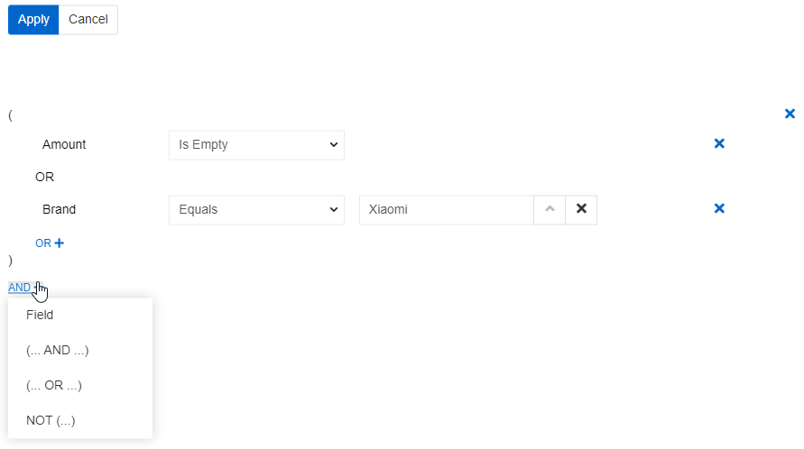
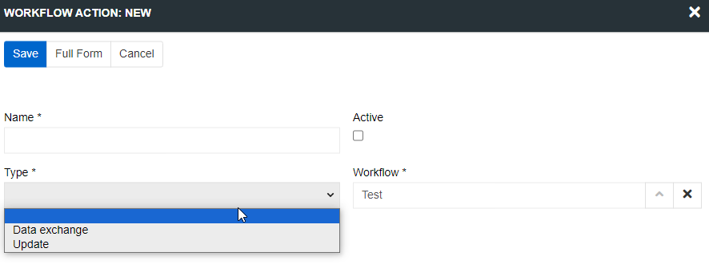

# Workflows

The workflows module enables you to implement and manage different processes and actions, triggered by certain events in the system and taking account of certain conditions. The main purpose of workflow configuration and programming is to automate processes and create/modify data records, to save time, minimize human error, and improve collaboration. Absolutely any workflow can be implemented.

The module enables you to define certain states (e.g. product status) for a workflow and transitions under certain conditions (e.g. the reviewer has approved the product data), which results in changing from one state to another (e.g. product status is changed to "approved"). Such changes can also be supplemented with certain actions (e.g. product is automatically activated and can be published on different channels).

Currently only transitions can be configured, everything else should implemented by programmers. Implementation of a simple workflow can take appx. 1-2 hours into account.

This module is based on the [Symfony Workflow Component](https://symfony.com/doc/current/components/workflow.html) aextending it with own specific features. So you can use this Component without any limitations. You can also use the [Symfony EventDispatcher Component](https://symfony.com/doc/current/components/event_dispatcher.html), which comes  with AtroCore out of the box, because the event handing in AtroCore is based on it.

## Concepts

A workflow is a model of a process in your application. It may be how the product description process goes from "draft" to "review" and "publish". 
A workflow is a process or a lifecycle that your objects go through. Each step or stage in the process is called a `place`. You also define `transitions` that describe the action of getting from one place to another.

### State Machines

A state machine is a subset of a workflow and its purpose is to hold the state of your model. The differences are:
Workflows can be in more than one place at the same time, whereas state machines can’t.
In order to apply a transition, workflows require that the object is in all the previous places of the transition, whereas state machines only require that the object is in at least one of those places.
For examples please refer to the official Symfony Documentation.

### Definition of a Workflow

The definition of a workflow consists of `places` and `transitions` to get from one place to another. The `GuardEvent` is used to decide the next steps to allow or disallow for a specific transition.

### Using Events

To make your workflows more flexible, you can construct the Workflow object with an `EventDispatcher`. You can now create event listeners to block transitions (i.e. depending on the data in the product description) and do additional actions when a workflow operation takes place (e.g. sending announcements).
Please see the official Symfony Documentation for more information about events.

## Creating a Workflow

You can configure as many workflows as you wish. More than one workflow can be appended to an entity.

Click on the button `Create Workflow` to create a new workflow.

To create a new workflow, define the "Name", then choose the "Trigger entity" to align with the workflow and the entity, which is going to be investigated when searching. Then define the "Trigger Actions" and "Conditions Type".

### Trigger Actions

For workflow to work you must set trigger actions. When mentioned action is done to a Trigger entity then workflow is started. You can choose multiple actions, but at least one is always required. For more advance settings use conditions.
 
   

### Conditions Type

There are two condition types available - "Basic" and "Twig". Their logic basically states: "trigger workflow on trigger action when condition is fulfilled (the results are true)".

#### Basic

For easier use you can select basic conditions. They follow common logic with AND OR and NOT. These are combined in any shape. Fields are the end results, and their options too look at are the same as for filtering. On the example below you can see a formula where workflow triggers on the trigger action when a field "amount" is empty or brand is Xiaomi.
 
   

#### Twig

Twig is more complicated use case but as a result more versatile. To use it you have to set a formula that results in a default Boolean variable "proceed" (). For more detailed twig guidelines and syntax please go to https://twig.symfony.com/doc/.

> Please note, conditions use database query to function. They are launched every time Trigger Actions are made. So, not to overload it with multiple queries, please, minimize amount of database queries by using best practices. For example, for twig you can set variables (like ) instead of doing full blown database queries for every field. You can also check if an entity is linked to another (like ) before setting variables.

## Workflow Actions

If all conditions are met, workflow actions are launched. They are Update and Data exchange. Data exchange is launching a selected connector or an export/import feed. Update is in fact a mass update set on condition. You can select any entity to update or set Self-Targeted. Setting Self-Targeted will update only triggering record. Multiple actions can be assigned to one workflow.
 
   

## Advanced Workflows
Any advanced workflows and business process modeling can be implemented by workflow programming. Please refer to the Symfony Documentation to get to know the process.

