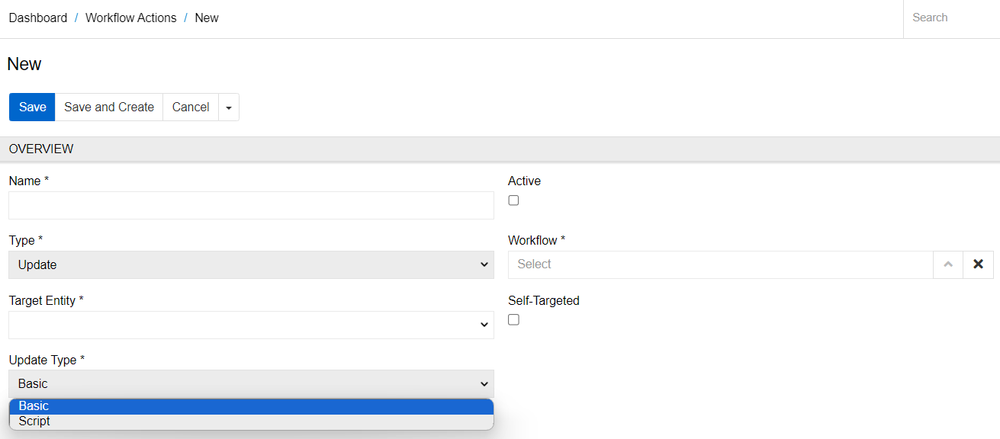
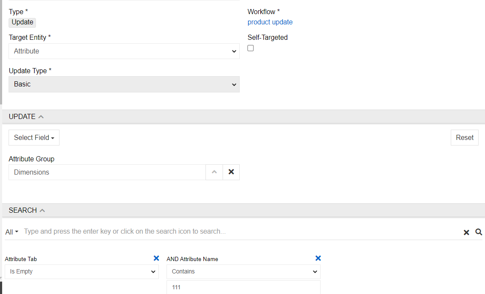
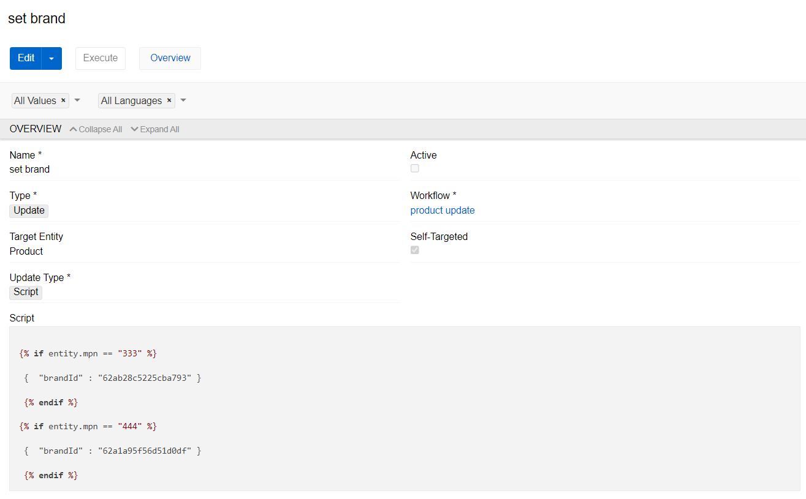

# Workflows

The workflows module enables you to implement and manage different processes and actions, triggered by certain events in the system and taking account of certain conditions. The main purpose of workflow configuration and programming is to automate processes and create/modify data records, to save time, minimize human error, and improve collaboration. Absolutely any workflow can be implemented.

The module enables you to define certain 'entities' (e.g. products) for a workflow and actions under certain conditions (e.g. the reviewer has approved the product data), which results in changing from one state to another (e.g. product status is changed to "approved"). Such changes can also be supplemented with certain actions (e.g. product is automatically activated and can be published on different channels).

This module is based on the [Symfony Workflow Component](https://symfony.com/doc/current/components/workflow.html) extending it with own specific features. So you can use this Component without any limitations. You can also use the [Symfony EventDispatcher Component](https://symfony.com/doc/current/components/event_dispatcher.html), which comes  with AtroCore out of the box, because the event handing in AtroCore is based on it.

## Creating a Workflow

You can configure as many workflows as you wish. More than one workflow can be appended to an entity.

Click on the button `Create Workflow` to create a new workflow.

To create a new workflow, define the "Name", then choose the "Trigger entity" to align with the workflow and the entity, which is going to be investigated when searching. Then define the "Trigger Actions" and "Conditions Type". Use the Sort Order field to set the order in which the workflows should be launched.

### Trigger Actions

For workflow to work you must set trigger actions. When mentioned action is done to a Trigger entity then workflow is started. You can choose multiple actions, but at least one is always required. For more advance settings use conditions.
 
   

### Conditions Type

There are two condition types available - "Basic" and "Twig". Their logic basically states: "trigger workflow on trigger action when condition is fulfilled (the results are true)".

#### Basic

For easier use you can select basic conditions. They follow common logic with AND OR and NOT. These are combined in any shape. Fields are the end results, and their options to look at are the same as for filtering. On the example below you can see a formula where workflow triggers on the trigger action when a field "amount" is empty or brand is Xiaomi.
 
   

#### Twig

Twig is more complicated use case but as a result more versatile. To use it you have to set a formula that results in a default Boolean variable "proceed" (). For more detailed twig guidelines and syntax please go to https://twig.symfony.com/doc/.

> Please note, conditions use database query to function. They are launched every time Trigger Actions are made. So, not to overload it with multiple queries, please, minimize amount of database queries by using best practices. For example, for twig you can set variables (like ) instead of doing full blown database queries for every field. You can also check if an entity is linked to another (like ) before setting variables.

## Workflow Actions

If all conditions are met, workflow actions are launched. They are Update and Data exchange. Data exchange is launching a selected connector or an export/import feed. Update is in fact a mass update set on condition. You can select any entity to update or set Self-Targeted. Setting Self-Targeted will update only triggering record. Multiple actions can be assigned to one workflow.

You can also run the workflow actions manually. To do so, visit workflow action page and press 'Execute' button. You can also run multiple workflow actions at the same time. To do this, you need to go to the entity Workflow Actions, check the actions you want to run, click the Action --> Execute. 
 
   

There are two types of update actions: Basic and Script. Their principle is the same as for workflow conditions. For both actions, you can set conditions inside the action itself. These conditions will be checked after the workflow conditions have been met. 

  

#### Basic

For the basic type, the conditions are set using a filter in the Search panel. The field (or fields) that you want to update using the workflow action must be specified in the Update panel. For example, an action that should update an Attribute group for all attributes whose name contains the characters "111" and no Attribute Tab is specified would look like this:

   

#### Script

For the workflow actions of type Script, conditions can be specified both in the Search panel and in the Twig field (the Search panel is not available for a self-targeted action). The entity field you want to change is set via the script. The commands are the same as for any Twig field. For example, a Workflow Action of type Script, which sets a certain Brand for a product provided that the value of the field "mpn" equals "333" or "444", would look like this:

 

## Advanced Workflows
Any advanced workflows and business process modeling can be implemented by workflow programming. Please refer to the Symfony Documentation to get to know the process.

